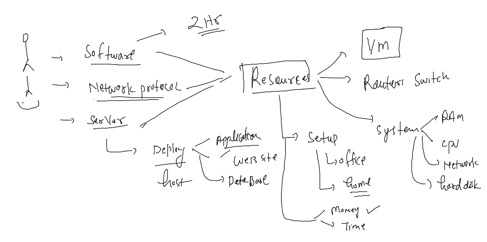
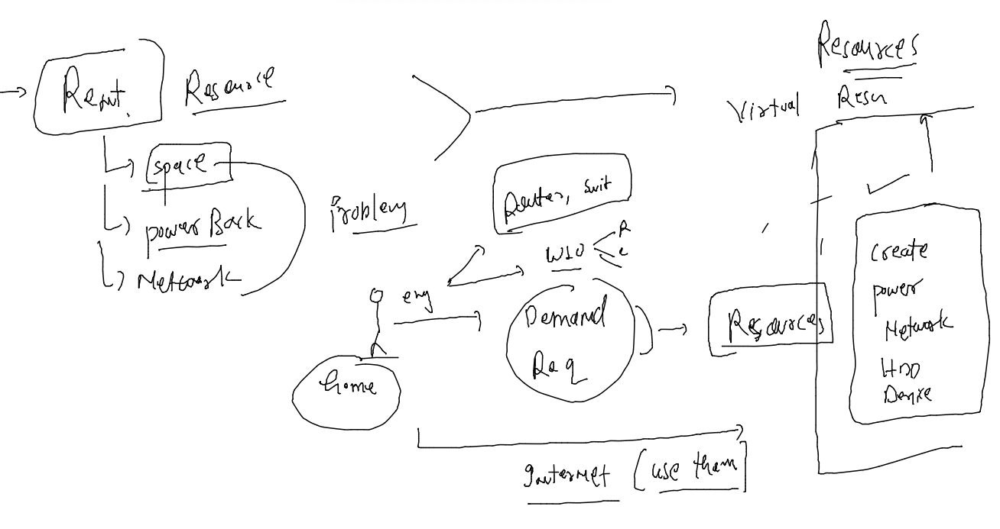
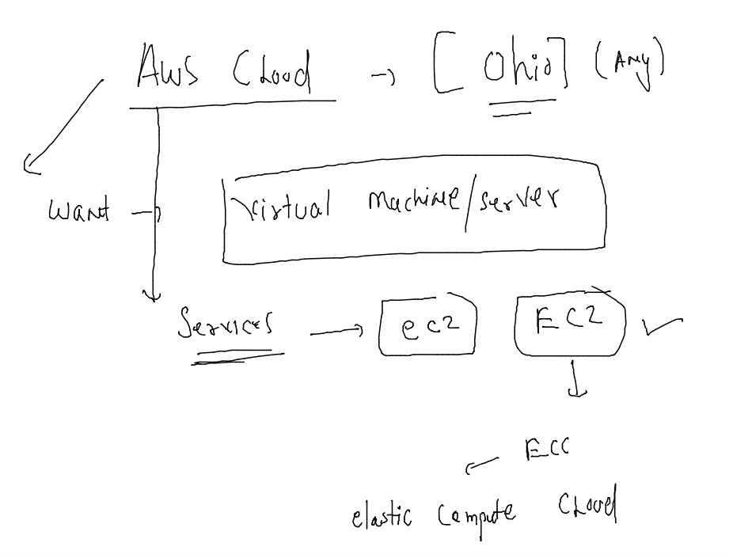
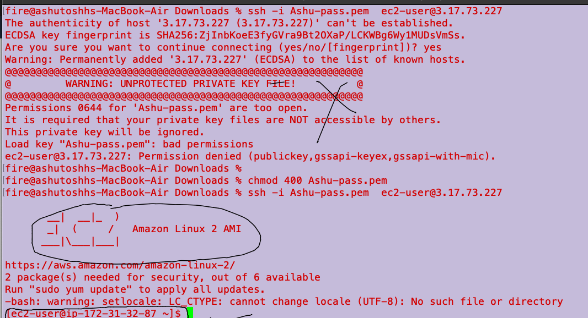
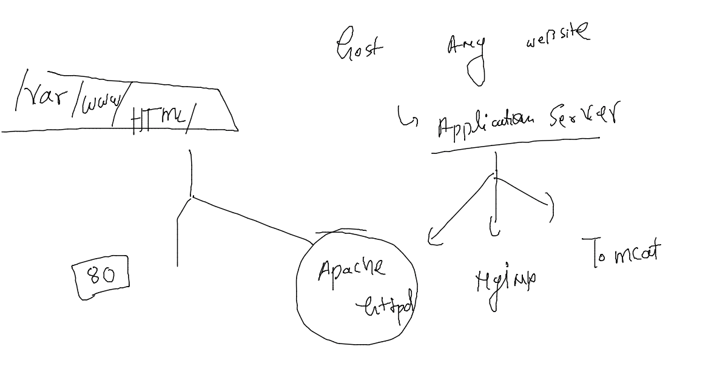
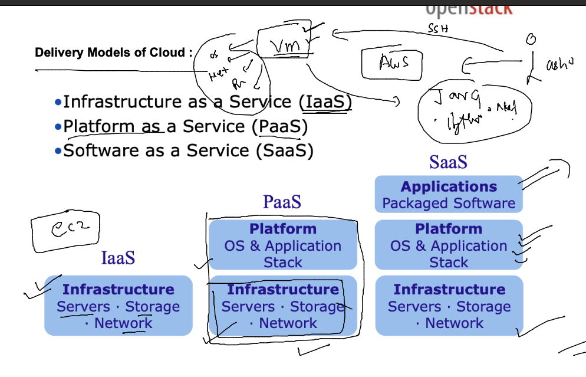

# HCL_devsecops

## training plan 


### problem with new setup for your application / network / Infraa 



### virtual resource provider -- 



## Virtual / cloud computing 


### PHysical vs Virtual machine / server 


### how to access any remote machine 


### we will be working in Ohio Region in AWS cloud platform 




### lets create our first virtual machine 

### connect to linux 



###

```
cd Downloads
ssh -i Ashu-pass.pem  ec2-user@3.17.73.227 
```

### application server here



## to setup httpd server 

### step1 install it 

```
sudo yum  install  httpd 
Failed to set locale, defaulting to C
Loaded plugins: extras_suggestions, langpacks, priorities, update-motd
amzn2-core                                                                                            | 3.7 kB  00:00:00     
Resolving Dependencies
--> Running transaction check
---> Package httpd.x86_64 0:2.4.53-1.amzn2 will be installed
--> Processing Dependency: httpd-tools = 2.4.53-1.amzn2 for package: httpd-2.4.53-1.amzn2.x86_64
--> Processing Dependency: httpd-filesystem = 2.4.53-1.amzn2 for package: httpd-2.4.53-1.amzn2.x86_64
--> Processing Dependency: system-logos-httpd for package: httpd-2.4.53-1.amzn2.x86_64
--> Processing Dependency: mod_http2 for packa
```

### copy website to apache httpd server 

```
 sudo -i
[root@ip-172-31-40-70 ~]# 
[root@ip-172-31-40-70 ~]# cd /var/www/html/
[root@ip-172-31-40-70 html]# ls
[root@ip-172-31-40-70 html]# echo hello i am ashutoshh  >index.html 
[root@ip-172-31-40-70 html]# ls
index.html
[root@ip-172-31-40-70 html]# 

```

### start httpd application server 

```
 systemctl start  httpd 
[root@ip-172-31-40-70 html]# systemctl status  httpd 
● httpd.service - The Apache HTTP Server
   Loaded: loaded (/usr/lib/systemd/system/httpd.service; disabled; vendor preset: disabled)
   Active: active (running) since Sat 2022-06-04 09:58:55 UTC; 7s ago
     Docs: man:httpd.service(8)
 Main PID: 3781 (httpd)

```

### Importance of load balancer in webapp services 


### cloning sample application 

```
 cd  /tmp/
[root@ip-172-31-32-87 tmp]# git clone https://github.com/schoolofdevops/html-sample-app.git
Cloning into 'html-sample-app'...
remote: Enumerating objects: 74, done.
remote: Total 74 (delta 0), reused 0 (delta 0), pack-reused 74
Receiving objects: 100% (74/74), 1.38 MiB | 10.03 MiB/s, done.
Resolving deltas: 100% (5/5), done.
[root@ip-172-31-32-87 tmp]# 
[root@ip-172-31-32-87 tmp]# ls
html-sample-app

```

### Cloud Delivery Models 




