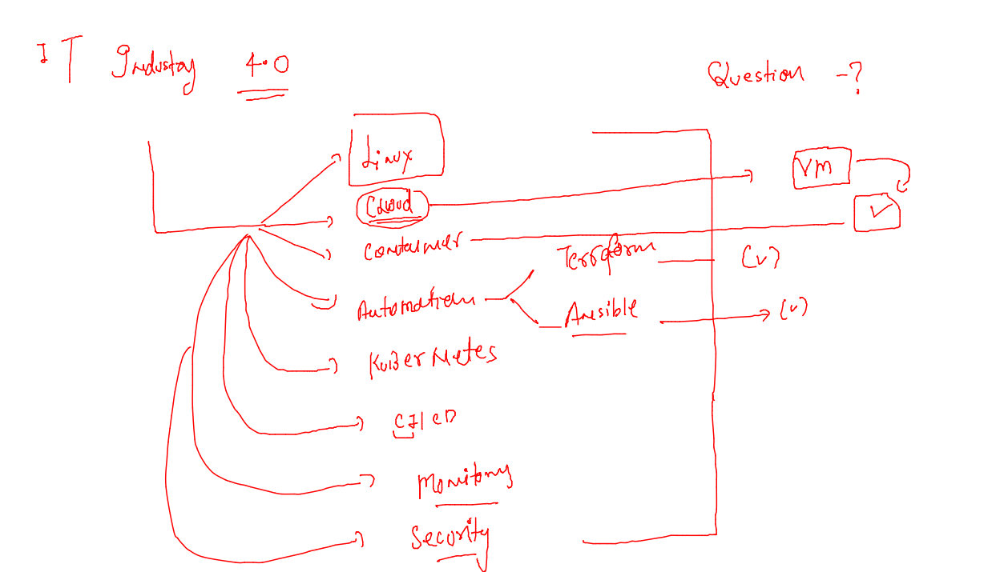
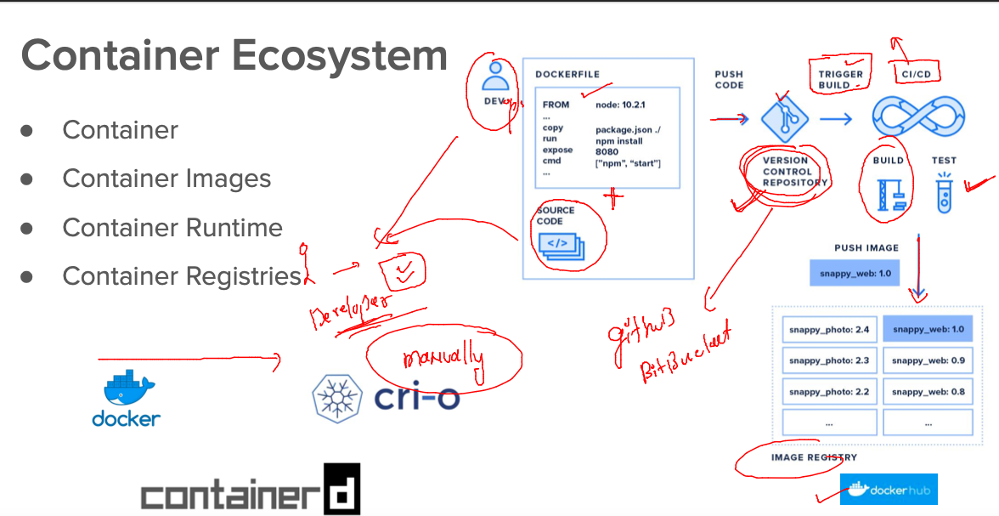
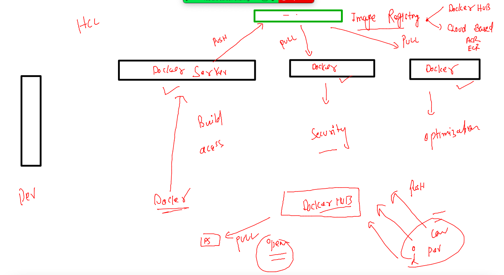

# HCL_devsecops

## training plan 


### industry 4.0 



### before CI lets do things manually 



### taking one webapp and doing containerization 

### build 

```
 cd hclwebapp/
[ashu@ip-172-31-46-30 hclwebapp]$ ls
Dockerfile  index.html
[ashu@ip-172-31-46-30 hclwebapp]$ docker  build  -t   ashuhcl:appv1  . 
Sending build context to Docker daemon  3.584kB
Step 1/3 : FROM nginx
 ---> 0e901e68141f
Step 2/3 : LABEL name=ashutoshh
 ---> Using cache
 ---> 9ab5a21f1081
Step 3/3 : COPY index.html /usr/share/nginx/html/
 ---> 07dfbf10a002
Successfully built 07dfbf10a002

```

### image sharing among docker servers 



### pushing image to docker hub 

```
[ashu@ip-172-31-46-30 hclwebapp]$  docker  tag    ashuhcl:appv1  docker.io/dockerashu/ashuhcl:appv1
[ashu@ip-172-31-46-30 hclwebapp]$ docker  login
Login with your Docker ID to push and pull images from Docker Hub. If you don't have a Docker ID, head over to https://hub.docker.com to create one.
Username: dockerashu
Password: 
WARNING! Your password will be stored unencrypted in /home/ashu/.docker/config.json.
Configure a credential helper to remove this warning. See
https://docs.docker.com/engine/reference/commandline/login/#credentials-store

Login Succeeded

```

### pushing 

```
ashu@ip-172-31-46-30 hclwebapp]$ docker  push  docker.io/dockerashu/ashuhcl:appv1
The push refers to repository [docker.io/dockerashu/ashuhcl]
51fc105a831c: Pushed 
33e3df466e11: Mounted from library/nginx 
747b7a567071: Mounted from library/nginx 
57d3fc88cb3f: Mounted from library/nginx 
53ae81198b64: Mounted from library/nginx 
58354abe5f0e: Mounted from library/nginx 
ad6562704f37: Mounted from library/httpd 
appv1: digest: sha256:f9f2b18402eb5dedab612bef11c2fe4765a9fe8288aab8b31bc7e66213b7215b size: 1777

```

### with jenkins lets use docker-compose to automate docker command steps 


###

```
[ashu@ip-172-31-46-30 ashuhclwebapp]$ docker-compose up -d 
[+] Running 2/2
 ⠿ Network ashuhclwebapp_default  Created                                                0.1s
 ⠿ Container ashuc111             Started                                                1.1s
[ashu@ip-172-31-46-30 ashuhclwebapp]$ docker-compose  ps
NAME                COMMAND                  SERVICE             STATUS              PORTS
ashuc111            "/docker-entrypoint.…"   ashuapp1            running             0.0.0.0:1234->80/tcp, :::1234->80/tcp
[ashu@ip-172-31-46-30 ashuhclwebapp]$ docker-compose  down
[+] Running 2/2
 ⠿ Container ashuc111             Removed                                                0.3s
 ⠿ Network ashuhclwebapp_default  Removed                                                0.1s
[ashu@ip-172-31-46-30 ashuhclwebapp]$ 
```


