# HCL_devsecops

## training plan 


###  revision 

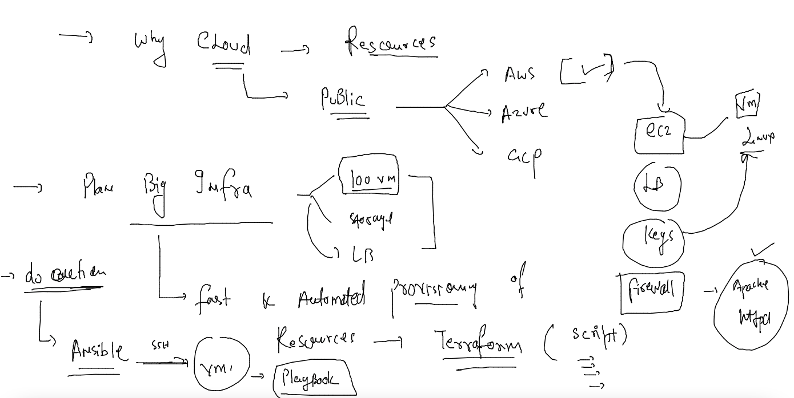

### Ansible setup and its connection 


### running ansible adhoc command 

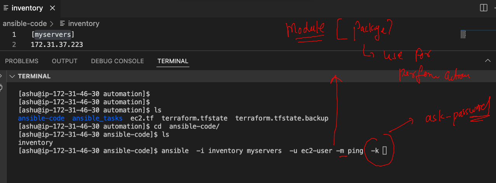

### testing connection from ansible to target 

```
[ashu@ip-172-31-46-30 ansible-code]$ ansible  -i inventory myservers  -u ec2-user -m ping  -k 
SSH password: 
[WARNING]: Platform linux on host 172.31.46.194 is using the discovered Python interpreter at /usr/bin/python, but future
installation of another Python interpreter could change this. See
https://docs.ansible.com/ansible/2.9/reference_appendices/interpreter_discovery.html for more information.
172.31.46.194 | SUCCESS => {
    "ansible_facts": {
        "discovered_interpreter_python": "/usr/bin/python"
    }, 
    "changed": false, 
    "ping": "pong"

```

### writing playbooks 

## Inventory file 

```
[myservers]
172.31.37.223
172.31.32.236
172.31.36.63
172.31.46.194
172.31.32.32
172.31.36.116
172.31.46.230
172.31.37.89
172.31.36.64
172.31.45.68
```

### first playbook 

```
---
- hosts: myservers
  remote_user: ec2-user 
  tasks: 
  - name: testing all the target servers
    command: date 
```

### running playbook 

```
 cd  ansible-code/
[ashu@ip-172-31-46-30 ansible-code]$ ls
apache.yaml  inventory
[ashu@ip-172-31-46-30 ansible-code]$ ansible-playbook -i inventory apache.yaml --ask-pass

SSH password: 

PLAY [myservers] ****************************************************************************************************

TASK [Gathering Facts] **********************************************

TASK [testing all the target servers] *******************************************************************************
changed: [172.31.32.32]
changed: [172.31.32.236]
changed: [172.31.37.223]
changed: [172.31.46.194]
changed: [172.31.36.63]
changed: [172.31.36.116]
changed: [172.31.46.230]
changed: [172.31.37.89]
changed: [172.31.36.64]
changed: [172.31.45.68]

PLAY RECAP **********************************************************************************************************
172.31.32.236              : ok=2    changed=1    unreachable=0    failed=0    skipped=0    rescued=0    ignored=0   
172.31.32.32               : ok=2    changed=1    unreachable=0    failed=0    skipped=0    rescued=0    ignored=0   
172.31.36.116              : ok=2    changed=1    unreachable=0    failed=0    skipped=0    rescued=0    ignored=0   
172.31.36.63               : ok=2    changed=1    unreachable=0    failed=0    skipped=0    rescued=0    ignored=0   
172.31.36.64               : ok=2    changed=1    unreachable=0    failed=0    skipped=0    rescued=0    ignored=0   
172.31.37.223              : ok=2    changed=1    unreachable=0    failed=0    skipped=0    rescued=0    ignored=0   
172.31.37.89               : ok=2    changed=1    unreachable=0    failed=0    skipped=0    rescued=0    ignored=0   
172.31.45.68               : ok=2    changed=1    unreachable=0    failed=0    skipped=0    rescued=0    ignored=0   
172.31.46.194              : ok=2    changed=1    unreachable=0    failed=0    skipped=0    rescued=0    ignored=0   
172.31.46.230              : ok=2    changed=1    unreachable=0    failed=0    skipped=0    rescued=0    ignored=0   

```

### playbook 2 

```
---
- hosts: myservers
  remote_user: ec2-user 
  tasks: 
  - name: testing all the target servers
    command: date 
    register: x # storing output using register 

  - name: showing output of date command 
    debug:
      msg: "{{ x }}"
```

### playbook 3

```
---
- hosts: myservers
  remote_user: ec2-user 
  tasks: 
  - name: testing all the target servers
    command: date 
    register: x # storing output using register 

  - name: showing output of date command 
    debug:
      msg: "{{ x.stdout }}"
```

### task 1 

## inventory 

```
[myservers]
172.31.37.223
172.31.32.236
172.31.36.63

[newvms]
172.31.46.194
172.31.32.32
172.31.36.116
172.31.46.230
172.31.37.89
172.31.36.64
172.31.45.68

```

### yaml playbook 

```
---
- hosts: myservers
  remote_user: ec2-user 
  tasks: 
  - name: testing all the target servers
    command: uptime
    register: z # storing output using register 

  - name: showing output of date command 
    debug:
      msg: "{{ z.stdout }}"
```

## run playbook 

```
 ec2.tf  terraform.tfstate  terraform.tfstate.backup
[ashu@ip-172-31-46-30 automation]$ cd  ansible-code/
[ashu@ip-172-31-46-30 ansible-code]$ ls
apache.yaml  inventory  test.yaml
[ashu@ip-172-31-46-30 ansible-code]$ ansible-playbook -i inventory  test.yaml  --ask-pass
SSH password: 

PLAY [myservers] **********************************************************************************

TASK [Gathering Facts] ****************************************************************************
[WARNING]: Platform linux on host 172.31.32.236 is using the discovered Python interpreter at
/usr/bin/python, but future installation of another Python interpreter could change this. See
https://docs.ansible.com/ansible/2.9/reference_appendices/interpreter_discovery.html for more
information.
ok: [172.31.32.236]
[WARNING]: Platform linux on host 172.31.36.63 is using the discovered Python interpreter at
/usr/bin/python, but future installation of another Python interpreter could change this. See
https://docs.ansible.com/ansible/2.9/reference_appendices/interpreter_discovery.html for more
information.
ok: [172.31.36.63]
[WARNING]: Platform linux on host 172.31.37.223 is using the discovered Python interpreter at
/usr/bin/python, but future installation of another Python interpreter could change this. See
https://docs.ansible.com/ansible/2.9/reference_appendices/interpreter_discovery.html for more
information.
ok: [172.31.37.223]

TASK [testing all the target servers] *************************************************************
changed: [172.31.32.236]
changed: [172.31.36.63]
changed: [172.31.37.223]

TASK [showing output of date command] *************************************************************
ok: [172.31.32.236] => {
    "msg": " 06:09:19 up  1:37,  1 user,  load average: 0.00, 0.01, 0.00"
}
ok: [172.31.37.223] => {
    "msg": " 06:09:19 up  1:37,  1 user,  load average: 0.00, 0.00, 0.00"
}
ok: [172.31.36.63] => {
    "msg": " 06:09:19 up  1:37,  1 user,  load average: 0.09, 0.03, 0.01"
}

PLAY RECAP ****************************************************************************************
172.31.32.236              : ok=3    changed=1    unreachable=0    failed=0    skipped=0    rescued=0    ignored=0   
172.31.36.63               : ok=3    changed=1    unreachable=0    failed=0    skipped=0    rescued=0    ignored=0   
172.31.37.223              : ok=3    changed=1    unreachable=0    failed=0    skipped=0    rescued=0    ignored=0   

```
### YAML 3 

```
---
- hosts: all
  remote_user: ec2-user 
  become: true
  tasks: 
  - name: testing all the target servers
    command: date 
    register: x # storing output using register 

  - name: showing output of date command 
    debug:
      msg: "{{ x.stdout }}"

  - name: installing apache httpd server 
    yum: 
      name: httpd
      state: present 
```

### running file 

```
ansible-playbook -i inventory  apache.yaml --ask-pass
```

### FInal apache server YAML and its targets 

```
---
- hosts: all
  remote_user: ec2-user 
  become: true
  tasks: 
  - name: testing all the target servers
    command: date 
    register: x # storing output using register 

  - name: showing output of date command 
    debug:
      msg: "{{ x.stdout }}"

  - name: installing apache httpd server 
    yum: 
      name: httpd
      state: present 

  - name: copy file from ansible machine to all the target machines
    copy: 
      src: ashu.html
      dest: /var/www/html/ashu.html # all target servers will have this file

  - name: starting httpd service 
    service:
      name: httpd
      state: started
```

### application deployment problem -- in History 

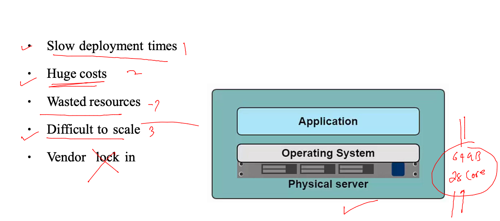

### app libs conflict 

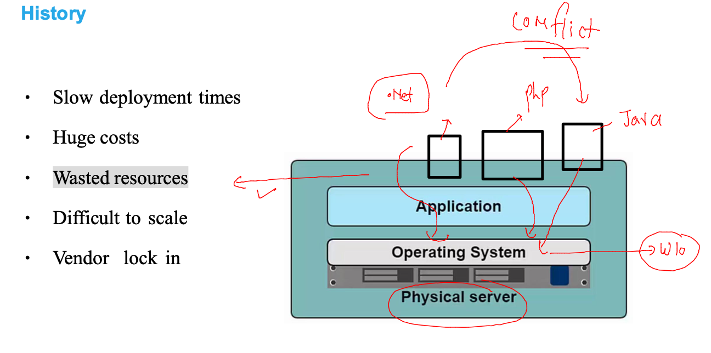

### introduction to hypervisor base vm 

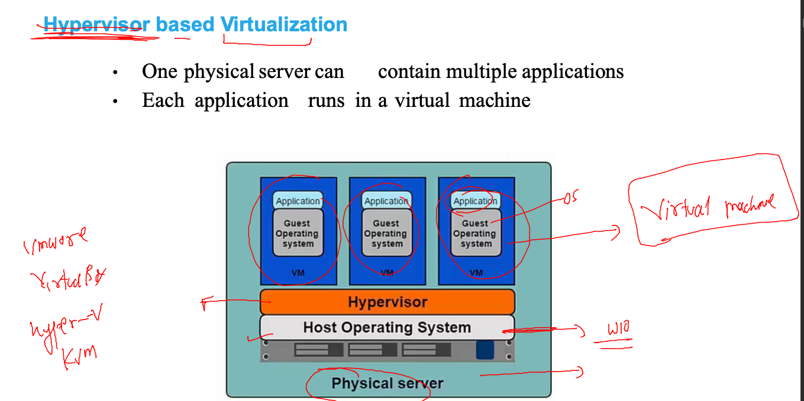

### understanding creating VM 

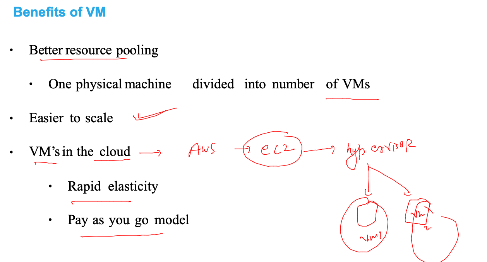


### app vm need more resources than application need

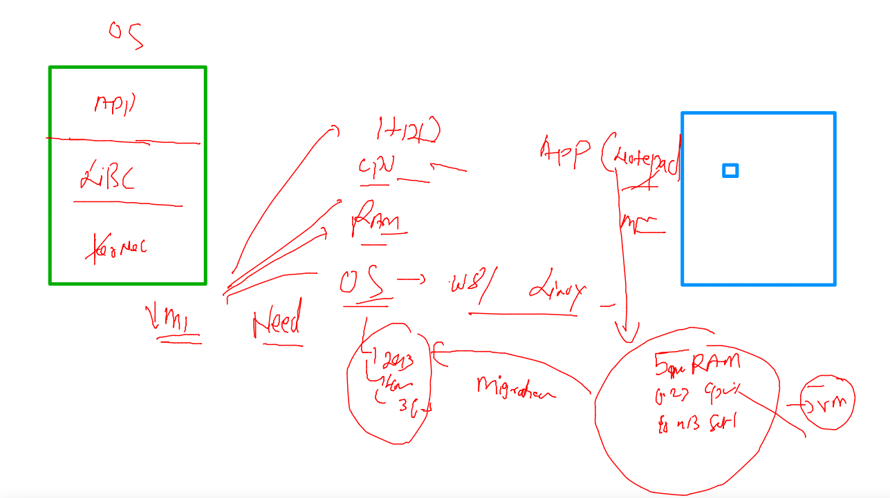

### vm are limited 

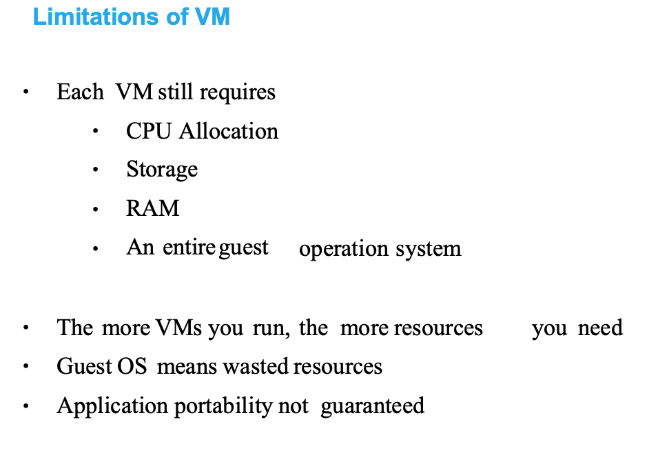

### welcome to containers and vm vs contianers 


### Docker being used to create containers 

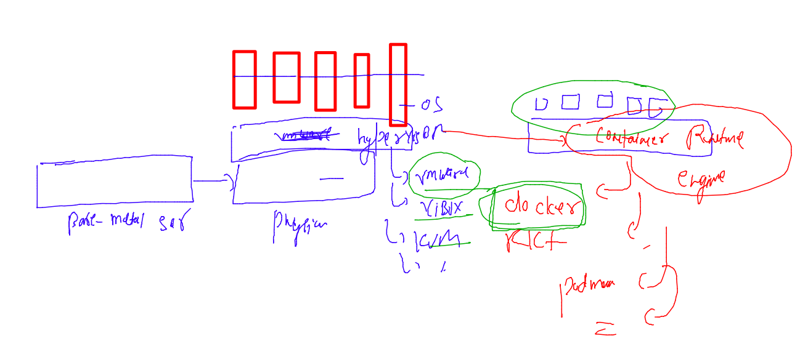


###  Docker for creating containers 

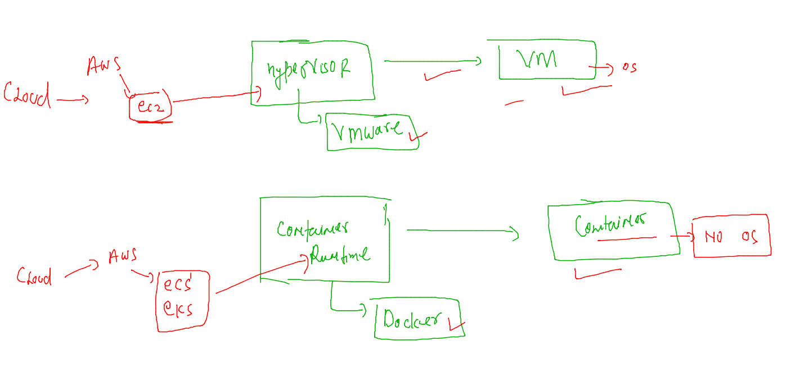

### Installing docker client 

```
yum install docker 
```

### testing it 

```
 docker  -v
Docker version 20.10.13, build a224086
[root@ip-172-31-46-30 ~]# 


```

### setup docker server --- 

```
yum  install docker  -y
Failed to set locale, defaulting to C
Loaded plugins: extras_suggestions, langpacks, priorities, update-motd
amzn2-core                                                                                           | 3.7 kB  00:00:00     
Resolving Dependencies
--> Running transaction check
---> Package docker.x86_64 0:20.10.13-2.amzn2 will be installed
--> Processing Dependency: runc >= 1.0.0 for package: docker-20.10.13-2.amzn2.x86_64
--> Processing Dependency: libcgroup >= 0.40.rc1-5.15 for package: docker-20.10.13-2.amzn2.x86_64
--> Processing Dependency: containerd >= 
```

### configure Docker server 

```
 cat  /etc/sysconfig/docker
# The max number of open files for the daemon itself, and all
# running containers.  The default value of 1048576 mirrors the value
# used by the systemd service unit.
DAEMON_MAXFILES=1048576

# Additional startup options for the Docker daemon, for example:
# OPTIONS="--ip-forward=true --iptables=true"
# By default we limit the number of open files per container
OPTIONS="--default-ulimit nofile=32768:65536 -H tcp://0.0.0.0:2375"

# How many seconds the sysvinit script waits for the pidfile to appear
# when starting the daemon.
DAEMON_PIDFILE_TIMEOUT=10
[root@ip-172-31-19-171 ~]# 


```

### starting docker serivce 

```
 systemctl enable --now docker  
Created symlink from /etc/systemd/system/multi-user.target.wants/docker.service to /usr/lib/systemd/system/docker.service.
[root@ip-172-31-19-171 ~]# systemctl status docker 
● docker.service - Docker Application Container Engine
   Loaded: loaded (/usr/lib/systemd/system/docker.service; enabled; vendor preset: disabled)
   Active: active (running) since Mon 2022-06-06 10:53:01 UTC; 6s ago
     Docs: https://docs.docker.com
  Process: 3754 ExecStartPre=/usr/libexec/docker/docker-setup-runtimes.sh (code=exited, status=0/SUCCESS)
  Process: 3752 ExecStartPre=/bin/mkdir
```

### How to connect remote docker engine from docker client 


```
[ashu@ip-172-31-46-30 automation]$ docker  context ls
NAME        DESCRIPTION                               DOCKER ENDPOINT               KUBERNETES ENDPOINT   ORCHESTRATOR
default *   Current DOCKER_HOST based configuration   unix:///var/run/docker.sock                         swarm
[ashu@ip-172-31-46-30 automation]$ 
[ashu@ip-172-31-46-30 automation]$ docker  context  create  remote-docker  --docker host="tcp://172.31.19.171:2375" 
remote-docker
Successfully created context "remote-docker"
[ashu@ip-172-31-46-30 automation]$ docker  context ls
NAME            DESCRIPTION                               DOCKER ENDPOINT               KUBERNETES ENDPOINT   ORCHESTRATOR
default *       Current DOCKER_HOST based configuration   unix:///var/run/docker.sock                         swarm
remote-docker                                             tcp://172.31.19.171:2375                            
[ashu@ip-172-31-46-30 automation]$ docker  context use  remote-docker 
remote-docker
Current context is now "remote-docker"
[ashu@ip-172-31-46-30 automation]$ docker  context ls
NAME              DESCRIPTION                               DOCKER ENDPOINT               KUBERNETES ENDPOINT   ORCHESTRATOR
default           Current DOCKER_HOST based configuration   unix:///var/run/docker.sock                         swarm
remote-docker *                                             tcp://172.31.19.171:2375                            
[ashu@ip-172-31-46-30 automation]$ 

```

### lets check that --

```
ashu@ip-172-31-46-30 automation]$ docker  version 
Client:
 Version:           20.10.13
 API version:       1.41
 Go version:        go1.16.15
 Git commit:        a224086
 Built:             Thu Mar 31 19:20:32 2022
 OS/Arch:           linux/amd64
 Context:           remote-docker
 Experimental:      true

Server:
 Engine:
  Version:          20.10.13
  API version:      1.41 (minimum version 1.12)
  Go version:       go1.16.15
  Git commit:       906f57f
  Built:            Thu Mar 31 19:21:13 2022
  OS/Arch:          linux/amd64
  Experimental:     false
```

### 

```
[ashu@ip-172-31-46-30 automation]$ docker  info 
Client:
 Context:    remote-docker
 Debug Mode: false

Server:
 Containers: 0
  Running: 0
  Paused: 0
  Stopped: 0
 Images: 0
 Server Version: 20.10.13
 Storage Driver: overlay2
  Backing Filesystem: xfs
  Supports d_type: true
  Native Overlay Diff: true
  userxattr: false

```

### vm vs containers 

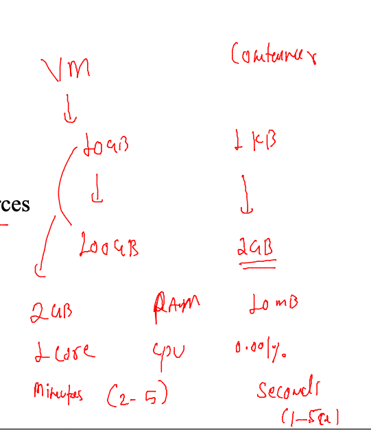

## send some request from docker client to docker server 

### checking number of images 

```
[ashu@ip-172-31-46-30 automation]$ docker  images
REPOSITORY   TAG       IMAGE ID   CREATED   SIZE
[ashu@ip-172-31-46-30 automation]$ 


```

### docker architecture 

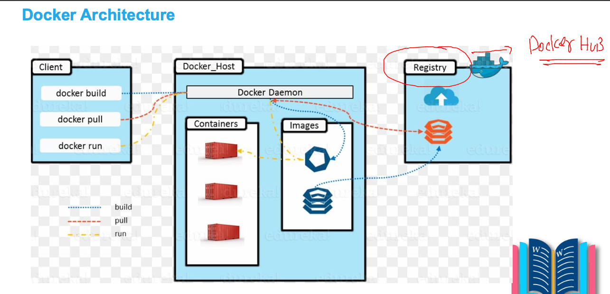

## docker client side operations 

### search 

```
 docker   search   httpd 
NAME                                    DESCRIPTION                                     STARS     OFFICIAL   AUTOMATED
httpd                                   The Apache HTTP Server Project                  4034      [OK]       
centos/httpd-24-centos7                 Platform for running Apache httpd 2.4 or bui…   44                   
centos/httpd                                                                            35                   [OK]
hypoport/httpd-cgi                      httpd-
```

### checking images 

```
docker images 

```

### pull images from docker hub 

```
docker  pull httpd
Using default tag: latest
latest: Pulling from library/httpd
42c077c10790: Pull complete 
77a357ba66a8: Pull complete 
c56c780a8904: Pull complete 
90bcc5e941a7: Pull complete 
571750298b32: Pull complete 
Digest: sha256:c479bec894c5a7f8878b28e52d03cc95b1e784612ecd01ac7c7394fc5fa2e6e2
Status: Downloaded newer image for httpd:latest
docker.io/library/httpd:latest
[ashu@ip-172-31-46-30 automation]$ docker  images
REPOSITORY   TAG       IMAGE ID       CREATED      SIZE
httpd        latest    98f93cd0ec3b   9 days ago   144MB
```

### lets start httpd container 

```
[ashu@ip-172-31-46-30 automation]$ docker  run --name ashuc1  -d  httpd:latest  
16920dce530ad3d2a1b70a2ec50ed2d2d73c7a684ca0e19ebbff1e449d7ce65f
[ashu@ip-172-31-46-30 automation]$ 
[ashu@ip-172-31-46-30 automation]$ 
[ashu@ip-172-31-46-30 automation]$ 
[ashu@ip-172-31-46-30 automation]$ 
[ashu@ip-172-31-46-30 automation]$ docker  ps
CONTAINER ID   IMAGE          COMMAND              CREATED         STATUS         PORTS     NAMES
16920dce530a   httpd:latest   "httpd-foreground"   5 seconds ago   Up 4 seconds   80/tcp    ashuc1
[ashu@ip-172-31-46-30 automation]$ 


```

### see list of running containers 

```
[ashu@ip-172-31-46-30 automation]$ docker  ps
CONTAINER ID   IMAGE          COMMAND              CREATED          STATUS          PORTS     NAMES
6ddefaad36cf   httpd:latest   "httpd-foreground"   22 seconds ago   Up 21 seconds   80/tcp    rajuc1
8d3f8df9ce12   httpd:latest   "httpd-foreground"   24 seconds ago   Up 23 seconds   80/tcp    saic1
e4e9f8760303   httpd:latest   "httpd-foreground"   27 seconds ago   Up 26 seconds   80/tcp    vamshi1
16920dce530a   httpd:latest   "httpd-foreground"   36 seconds ago   Up 35 seconds   80/tcp    ashuc1
[ashu@ip-172-31-46-30 automation]$ 

```

### vm vs containers resources consumption 

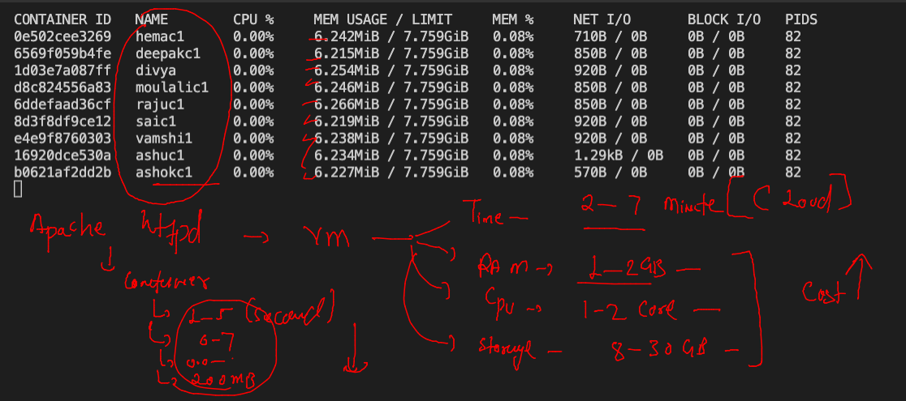

### stop container 

```
 docker  stop  ashuc1
ashuc1
```

### start a container 

```
docker  start  ashuc1
ashuc1
[ashu@ip-172-31-46-30 automation]$ docker  ps
CONTAINER ID   IMAGE          COMMAND              CREATED          STATUS         PORTS     NAMES
16920dce530a   httpd:latest   "httpd-foreground"   14 minutes ago   Up 2 seconds   80/tcp    ashuc1
[ashu@ip-172-31-46-30 automation]$ 

```

### check logs of docker 

```
ashu@ip-172-31-46-30 automation]$ docker  logs  ashuc1
AH00558: httpd: Could not reliably determine the server's fully qualified domain name, using 172.17.0.2. Set the 'ServerName' directive globally to suppress this message
AH00558: httpd: Could not reliably determine the server's fully qualified domain name, using 172.17.0.2. Set the 'ServerName' directive globally to suppress this message
[Mon Jun 06 11:53:34.106909 2022] [mpm_
```

### access container from docker client 

```
docker  exec  -it  ashuc1   bash 
root@16920dce530a:/usr/local/apache2# 
root@16920dce530a:/usr/local/apache2# 
root@16920dce530a:/usr/local/apache2# ls
bin  build  cgi-bin  conf  error  htdocs  icons  include  logs  modules
root@16920dce530a:/usr/local/apache2# cat  /etc/os-release 
PRETTY_NAME="Debian GNU/Linux 11 (bullseye)"
NAME="Debian GNU/Linux"
VERSION_ID="11"
VERSION="11 (bullseye)"
VERSION_CODENAME=bullseye
ID=debian
HOME_URL="https://www.debian.org/"
SUPPORT_URL="https://www.debian.org/support"
BUG_REPORT_URL="https://bugs.debian.org/"
root@16920dce530a:/usr/local/apache2# exit
exit

```

