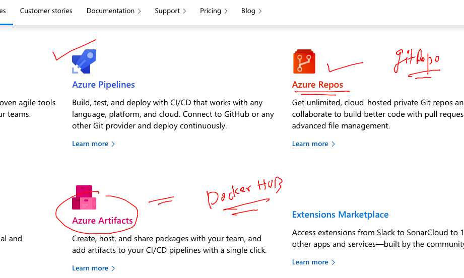

# HCL_devsecops

## training plan 


### CI CD -- devops tools


### jenkins comparasion with azure devops 



### after CI lets write CD step there 

```
kubectl  create  deployment ashufinal-deploy --image=dockerashu/ashuhcl:appfinal  --port 80  --dry-run=client -o yaml >finaldeploy.yaml 
```

### deploy it

```
[ashu@ip-172-31-46-30 k8s-deploy]$ kubectl create -f finaldeploy.yaml 
deployment.apps/ashufinal-deploy created
[ashu@ip-172-31-46-30 k8s-deploy]$ kubectl  get deploy 
NAME               READY   UP-TO-DATE   AVAILABLE   AGE
ashufinal-deploy   1/1     1            1           4s
[ashu@ip-172-31-46-30 k8s-deploy]$ kubectl  get po
NAME                                READY   STATUS    RESTARTS   AGE
ashufinal-deploy-784f87c4bc-68r4t   1/1     Running   0          7s
```


