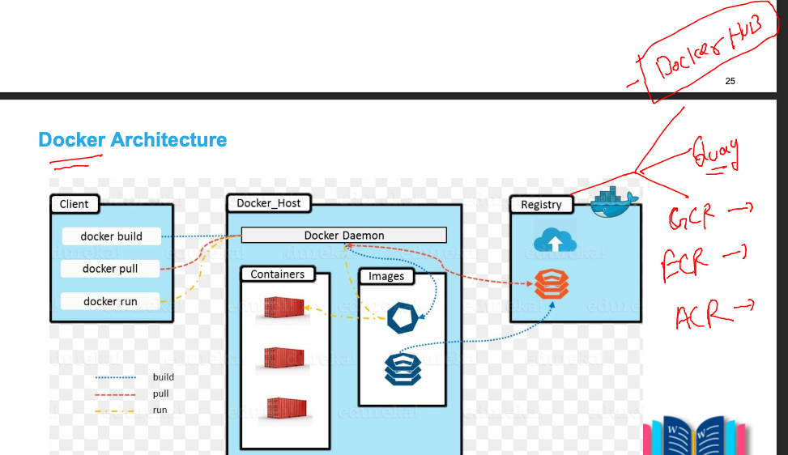
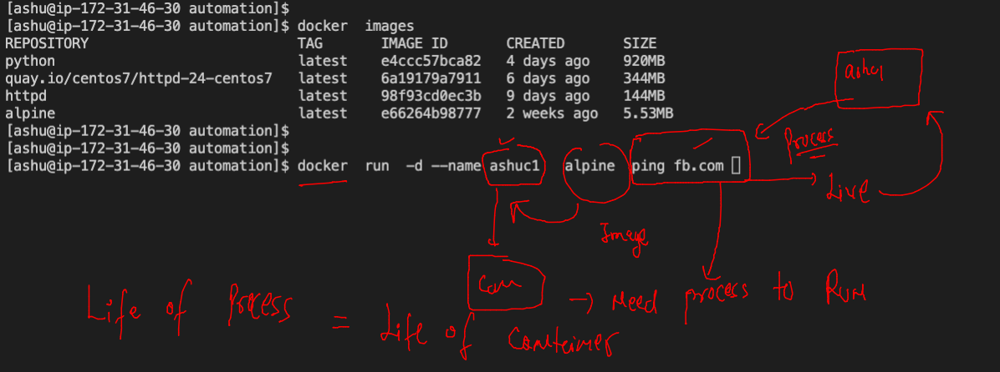
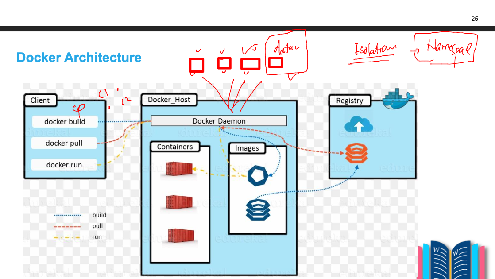
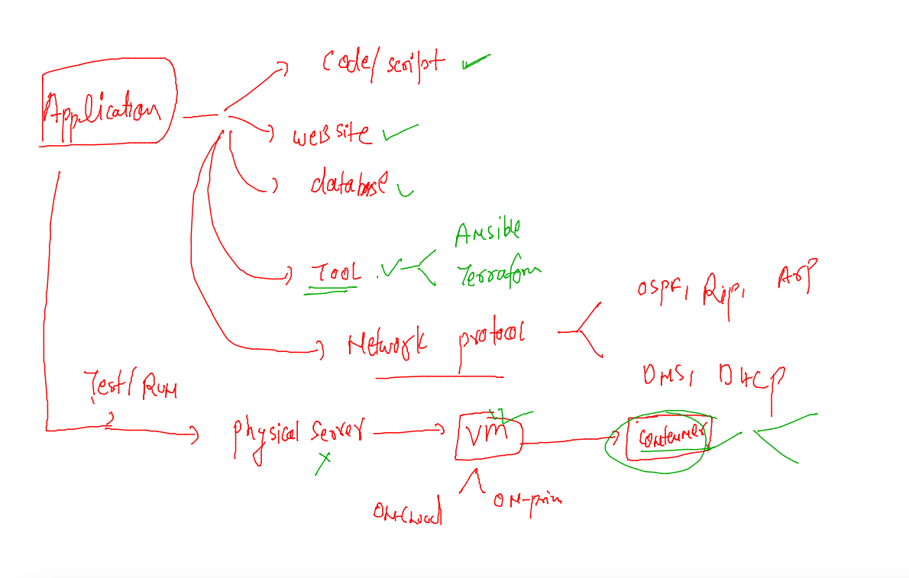
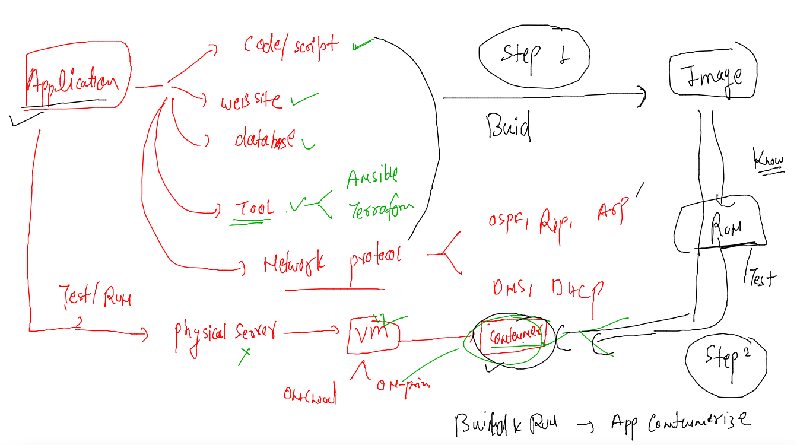
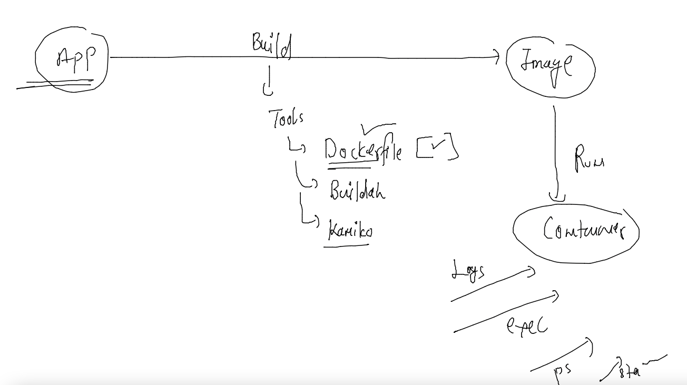
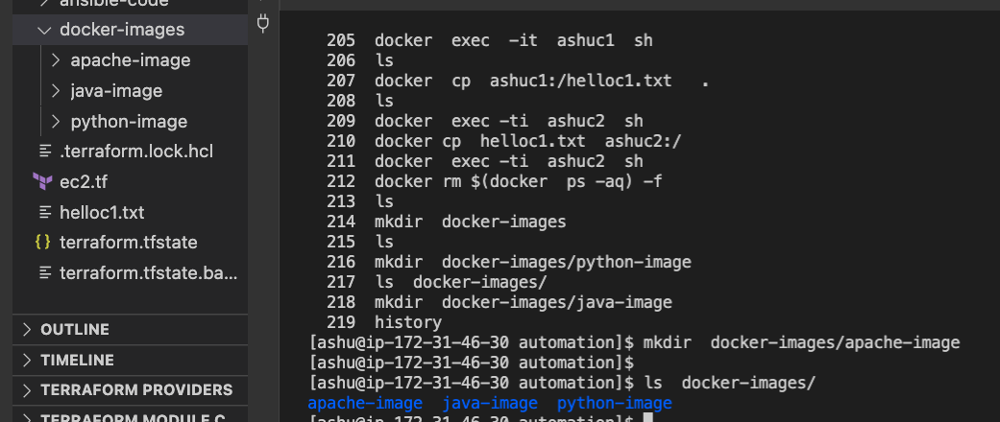
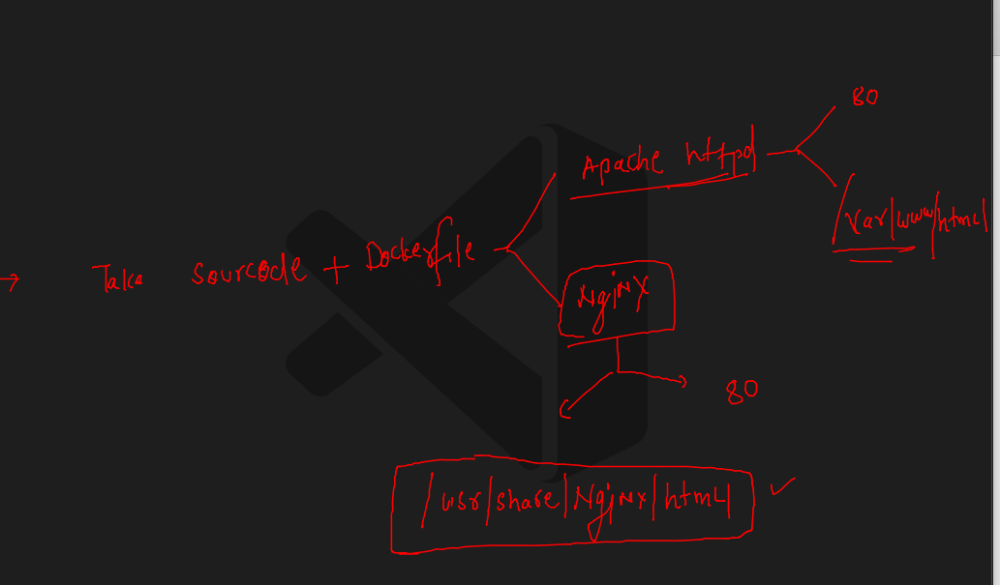
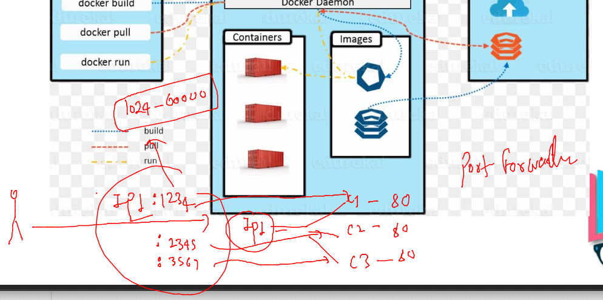

# HCL_devsecops

## training plan 


## DOcker more details 

### lets check connection from docker client to docker host 

```
 docker  context  ls
NAME              DESCRIPTION                               DOCKER ENDPOINT               KUBERNETES ENDPOINT   ORCHESTRATOR
default           Current DOCKER_HOST based configuration   unix:///var/run/docker.sock                         swarm
remote-docker *                                             tcp://172.31.19.171:2375                            
[ashu@ip-172-31-46-30 automation]$ 


```
###

```
 docker images
REPOSITORY   TAG       IMAGE ID       CREATED      SIZE
httpd        latest    98f93cd0ec3b   9 days ago   144MB
[ashu@ip-172-31-46-30 automation]$ 

```

### docker registry is a place where all images are present 



### pulling image from docker hub 

```
[ashu@ip-172-31-46-30 automation]$ docker  pull  alpine 
Using default tag: latest
latest: Pulling from library/alpine
2408cc74d12b: Pull complete 
Digest: sha256:686d8c9dfa6f3ccfc8230bc3178d23f84eeaf7e457f36f271ab1acc53015037c
Status: Downloaded newer image for alpine:latest
docker.io/library/alpine:latest
[ashu@ip-172-31-46-30 automation]$ docker  images
REPOSITORY   TAG       IMAGE ID       CREATED       SIZE
python       latest    e4ccc57bca82   4 days ago    920MB
httpd        latest    98f93cd0ec3b   9 days ago    144MB
alpine       latest    e66264b98777   2 weeks ago   5.53MB
[ashu@ip-172-31-46-30 automation]$ 


```

### pulling image from quay registry 

```
docker pull quay.io/centos7/httpd-24-centos7 
Using default tag: latest
latest: Pulling from centos7/httpd-24-centos7
c61d16cfe03e: Pull complete 
53fe1d286177: Pull complete 
d127ac58990a: Pull complete 
Digest: sha256:387987889f8851668a5d7fc409d96d7723459b723d7634b2a60c9bdc1122dc96
Status: Downloaded newer image for quay.io/centos7/httpd-24-centos7:latest
quay.io/centos7/httpd-24-centos7:latest
[ashu@ip-172-31-46-30 automation]$ docker  imaegs
docker: 'imaegs' is not a docker command.
See 'docker --help'
[ashu@ip-172-31-46-30 automation]$ docker  images
REPOSITORY                         TAG       IMAGE ID       CREATED       SIZE
python                             latest    e4ccc57bca82   4 days ago    920MB
quay.io/centos7/httpd-24-centos7   latest    6a19179a7911   6 days ago    344MB
httpd                              latest    98f93cd0ec3b   9 days ago    144MB
alpine                             latest    e66264b98777 
```

### life cycle of a container 



### check more docker understanding commands 

```
183  docker  ps
  184  docker  logs  ashuc1 

```

###  access container shell

```
 docker  exec -it  ashuc1  sh 
/ # 
/ # 
/ # cat  /etc/os-release 
NAME="Alpine Linux"
ID=alpine
VERSION_ID=3.16.0
PRETTY_NAME="Alpine Linux v3.16"
HOME_URL="https://alpinelinux.org/"
BUG_REPORT_URL="https://gitlab.alpinelinux.org/alpine/aports/-/issues"
/ # 
/ # exit

```

### to kill contaienr forcefully --

```
docker  kill ashuc1
```
### now if you want to remove container forever 

```
docker  rm  ashuc1
```
### ANswer of question 1 

```
docker run -d  --name ashuc1  alpine  ping fb.com 
679bd7a32f3c3db4ff64107094724e00723b3ab48dd0192102f28a605f902690
[ashu@ip-172-31-46-30 automation]$ docker run -d  --name ashuc2  alpine  ping fb.com 
3c224acbe2091b776bae61dc60df014d7448e55a1596c25fbd521fce1655dbd9
[ashu@ip-172-31-46-30 automation]$ 
[ashu@ip-172-31-46-30 automation]$ 
[ashu@ip-172-31-46-30 automation]$ docker  exec  -it  ashuc1  sh 
/ # 
/ # pwd
/
/ # ls
bin    etc    lib    mnt    proc   run    srv    tmp    var
dev    home   media  opt    root   sbin   sys    usr
/ # echo hello i am ashutoshhh  >helloc1.txt 
/ # s
sh: s: not found
/ # ls
bin          helloc1.txt  media        proc         sbin         tmp
dev          home         mnt          root         srv          usr
etc          lib          opt          run          sys          var
/ # 

```

### 

```
ls
ansible-code  ansible_tasks  ec2.tf  terraform.tfstate  terraform.tfstate.backup
[ashu@ip-172-31-46-30 automation]$ docker  cp  ashuc1:/helloc1.txt   .  
[ashu@ip-172-31-46-30 automation]$ ls
ansible-code  ansible_tasks  ec2.tf  helloc1.txt  terraform.tfstate  terraform.tfstate.backup
[ashu@ip-172-31-46-30 automation]$ 
[ashu@ip-172-31-46-30 automation]$ 
[ashu@ip-172-31-46-30 automation]$ 
[ashu@ip-172-31-46-30 automation]$ docker  exec -ti  ashuc2  sh 
/ # ls 
bin    etc    lib    mnt    proc   run    srv    tmp    var
dev    home   media  opt    root   sbin   sys    usr
/ # exit
[ashu@ip-172-31-46-30 automation]$ docker cp  helloc1.txt  ashuc2:/
[ashu@ip-172-31-46-30 automation]$ docker  exec -ti  ashuc2  sh 
/ # ls
bin          helloc1.txt  media        proc         sbin         tmp
dev          home         mnt          root         srv          usr
etc          lib          opt          run          sys          var
/ # exit
[ashu@ip-172-31-46-30 automation]$ 
```

### containers are isolated to each other due to Namespace 



### application containerization 



### application containerization -- using build and run 



### building image using dockerfile 



### for a better management i am creating folders

```
 mkdir  docker-images
[ashu@ip-172-31-46-30 automation]$ ls
ansible-code   docker-images  helloc1.txt        terraform.tfstate.backup
ansible_tasks  ec2.tf         terraform.tfstate
[ashu@ip-172-31-46-30 automation]$ mkdir  docker-images/python-image
[ashu@ip-172-31-46-30 automation]$ ls  docker-images/
python-image
[ashu@ip-172-31-46-30 automation]$ 

```

### creating directory structure 



### lets containerized python script 

### code 

```
import time
while True:
    print("Hello all , welcome to python..!!")
    time.sleep(3)
    print("Welcome to HCL India..")
    time.sleep(2)
    print("Welcome to Containers ..!!")
    print("______________________")
    time.sleep(3)
```

### Dockerfile 

```
FROM python
# we are asking to docker that plz pull python image from docker hub 
LABEL name=ashutoshh
LABEL email=ashutoshh@linux.com
# above info is optional but this is about your self 
RUN mkdir  /ashucode 
# in this image create a folder-- you can give any command 
COPY hcl.py /ashucode/hcl.py
# copy code from docker client to docker server inside image which we are building  
CMD ["python","/ashucode/hcl.py"]
# we use cmd to fix the default process of image 


```

### lets build image 

```
 docker  images
REPOSITORY   TAG       IMAGE ID   CREATED   SIZE
[ashu@ip-172-31-46-30 automation]$ docker  build  -t  ashupython:v1  docker-images/python-image/ 
Sending build context to Docker daemon  3.072kB
Step 1/6 : FROM python
latest: Pulling from library/python
e756f3fdd6a3: Pull complete 
bf168a674899: Pull complete 
e604223835cc: Pull complete 
6d5c91c4cd86: Pull complete 
2cc8d8854262: Extracting  159.9MB/196.7MB
2767dbfeeb87: Download complete 
e5f27d860d89: Download complete 

```

### another way 

```
 
[ashu@ip-172-31-46-30 automation]$ cd  docker-images/python-image/
[ashu@ip-172-31-46-30 python-image]$ ls
Dockerfile  hcl.py
[ashu@ip-172-31-46-30 python-image]$ 
[ashu@ip-172-31-46-30 python-image]$ 
[ashu@ip-172-31-46-30 python-image]$ docker  build  -t  ashupython:v1  .
Sending build context to Docker daemon  3.072kB
Step 1/6 : FROM python
 ---> e4ccc57bca82
Step 2/6 : LABEL name=ashutoshh
 ---> Using cache
 ---> 91d209d2e574

```

### checking images 

```
docker  images
REPOSITORY   TAG       IMAGE ID       CREATED              SIZE
ashupython   v1        c7642c24a589   About a minute ago   920MB
python       latest    e4ccc57bca82   4 days ago           920MB
```

### creating container 

```
[ashu@ip-172-31-46-30 python-image]$ docker  run -itd   --name ashupyc1  ashupython:v1   
8455ab073829651d111d189eed638f10f4f727663def66c3ad1145bae2ef6af6
[ashu@ip-172-31-46-30 python-image]$ docker ps
CONTAINER ID   IMAGE           COMMAND                  CREATED         STATUS         PORTS     NAMES
e4fd3a571af3   saipython:v1    "python /saicode/hcl…"   2 seconds ago   Up 1 second              saic1
8455ab073829   ashupython:v1   "python /ashucode/hc…"   4 seconds ago   Up 3 seconds             ashupyc1
```

### output 

   
```
254  docker  logs  ashupyc1
  255  docker  logs  -f  ashupyc1
```

### docker image for java code 

### code
```
class hcl { 
    public static void main(String args[]) 
    { 
        // test expression 
        while (true) { 
            System.out.println("Hello World"); 
  
            // update expression 
        } 
    } 
} 
```

### dockerfile

```
FROM openjdk
LABEL email=ashutoshh@linux.com
RUN mkdir /javacode/
COPY hcl.java /javacode/hcl.java
WORKDIR /javacode
# use of WORKDIR is to change folder location for this image
RUN javac hcl.java
# compiling code
CMD ["java","hcl"]
# defining parent process for docker image 


```

### image build 

```
on]$ ls
ansible-code   docker-images  helloc1.txt        terraform.tfstate.backup
ansible_tasks  ec2.tf         terraform.tfstate
[ashu@ip-172-31-46-30 automation]$ cd  docker-images/
[ashu@ip-172-31-46-30 docker-images]$ ls
apache-image  java-image  python-image
[ashu@ip-172-31-46-30 docker-images]$ cd  java-image/
[ashu@ip-172-31-46-30 java-image]$ ls
Dockerfile  hcl.java
[ashu@ip-172-31-46-30 java-image]$ docker build -t ashujava:v1 . 
Sending build context to Docker daemon  3.072kB
Step 1/7 : FROM openjdk
latest: Pulling from library/openjdk
90a00d516db1: Pull complete 
06fc60984518: Pull complete 
f4f239d0320f: Extracting [==================================>                ]  129.8MB/188.7MB

```

### creating container 

```
docker  run -itd --name ashujc1 ashujava:v1  
ce9dee9b39cb7ed8781636ebbbc92706874d689b55ed63cb98d814be9b78c964
[ashu@ip-172-31-46-30 java-image]$ docker  ps
CONTAINER ID   IMAGE         COMMAND      CREATED         STATUS        PORTS     NAMES
ce9dee9b39cb   ashujava:v1   "java hcl"   3 seconds ago   Up 1 second             ashujc1
[ashu@ip-172-31-46-30 java-image]$ 

```

### check more things 

```
docker  exec -it  ashujc1  bash 
bash-4.4# 
bash-4.4# 
bash-4.4# java -version 
openjdk version "18.0.1.1" 2022-04-22
OpenJDK Runtime Environment (build 18.0.1.1+2-6)
OpenJDK 64-Bit Server VM (build 18.0.1.1+2-6, mixed mode, sharing)
bash-4.4# jps
1 hcl
271 Jps
bash-4.4# exit
exit
```
### webapplication containerization 



### html code 

```
<!DOCTYPE html>
<html lang="en">
<head>
    <meta charset="UTF-8">
    <meta http-equiv="X-UA-Compatible" content="IE=edge">
    <meta name="viewport" content="width=device-width, initial-scale=1.0">
    <title>ashutoshh</title>
</head>
<body>
    <h1> Hello i am ashutoshh </h1>
    <h2> we are containerizing this website </h2>
    <h2> we are using nginx webserver this time </h2>
    
    
</body>
</html>

```

### dockerfile 

```
FROM nginx
LABEL name=ashutoshh
COPY ashu.html /usr/share/nginx/html/index.html 
COPY dog.jpg /usr/share/nginx/html/
# we are not using CMD 
# so from statement image CMD will be inherited 


```

### image build 

```
[ashu@ip-172-31-46-30 webapp-image]$ docker  build  -t ashunginx:v1  . 
Sending build context to Docker daemon  285.7kB
Step 1/4 : FROM nginx
latest: Pulling from library/nginx
42c077c10790: Pull complete 
62c70f376f6a: Pull complete 
915cc9bd79c2: Pull complete 
75a963e94de0: Pull complete 
7b1fab684d70: Pull complete 
db24d06d5af4: Pull complete 
Digest: sha256:2bcabc23b45489fb0885d69a06ba1d648aeda973fae7bb981bafbb884165e514
Status: Downloaded newer image for nginx:latest
 ---> 0e901e68141f
Step 2/4 : LABEL name=ashutoshh
 ---> Running in e7e572b7950f
Removing intermediate container e7e572b7950f
 ---> 9ab5a21f1081
Step 3/4 : COPY ashu.html /usr/share/nginx/html/index.html
 ---> e24d52b5d63b
Step 4/4 : COPY dog.jpg /usr/share/nginx/html/
 ---> c3f4da375687
Successfully built c3f4da375687
Successfully tagged ashunginx:v1
```

### creating container with port forwarding 



```
docker  run -itd --name ashuwebc1  -p  1234:80  ashunginx:v1  
9b7cf7e28f7eaa1f2fd1e2d1a9b3a86c497d51a3ae687b40fff5edd30971ec4a
[ashu@ip-172-31-46-30 webapp-image]$ docker  ps
CONTAINER ID   IMAGE          COMMAND                  CREATED         STATUS         PORTS                                   NAMES
9b7cf7e28f7e   ashunginx:v1   "/docker-entrypoint.…"   9 seconds ago   Up 8 seconds   0.0.0.0:1234->80/tcp, :::1234->80/tcp   ashuwebc1
[ashu@ip-172-31-46-30 webapp-image]$ 

```


