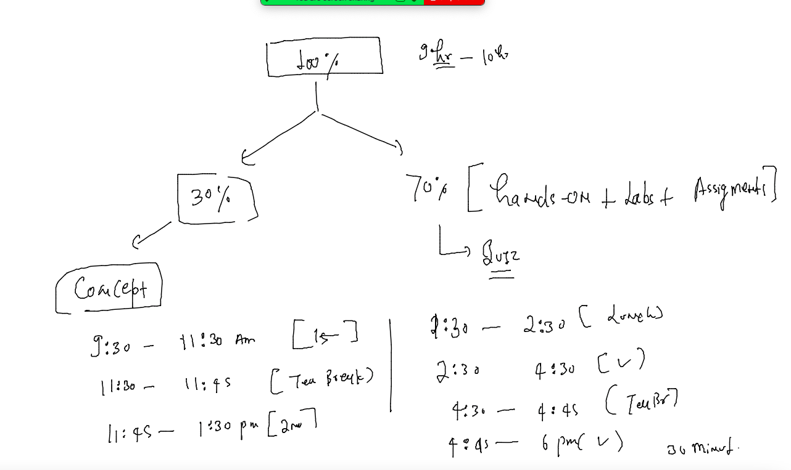
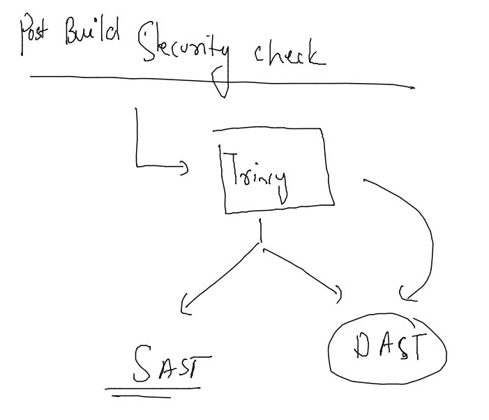
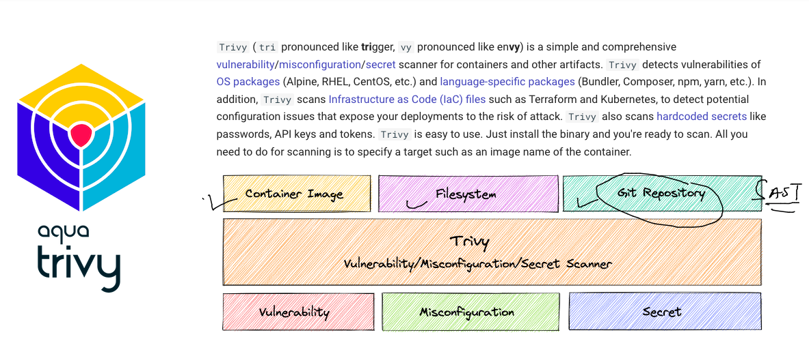

# HCL_devsecops

## training plan 



### CI CD -- devops tools


### jenkins comparasion with azure devops 


### after CI lets write CD step there 

```
kubectl  create  deployment ashufinal-deploy --image=dockerashu/ashuhcl:appfinal  --port 80  --dry-run=client -o yaml >finaldeploy.yaml 
```

### deploy it

```
[ashu@ip-172-31-46-30 k8s-deploy]$ kubectl create -f finaldeploy.yaml 
deployment.apps/ashufinal-deploy created
[ashu@ip-172-31-46-30 k8s-deploy]$ kubectl  get deploy 
NAME               READY   UP-TO-DATE   AVAILABLE   AGE
ashufinal-deploy   1/1     1            1           4s
[ashu@ip-172-31-46-30 k8s-deploy]$ kubectl  get po
NAME                                READY   STATUS    RESTARTS   AGE
ashufinal-deploy-784f87c4bc-68r4t   1/1     Running   0          7s
```
### creating service 

```
kubectl  get  deploy 
NAME               READY   UP-TO-DATE   AVAILABLE   AGE
ashufinal-deploy   1/1     1            1           8m18s
[ashu@ip-172-31-46-30 k8s-deploy]$ kubectl  expose deploy  ashufinal-deploy  --type NodePort --port 80 --name ashulb1234 --dry-run=client -o yaml >finallb.yaml 
[ashu@ip-172-31-46-30 k8s-deploy]$ ls
ashudep.yaml  ashupod1.yaml  deployment1.yaml  finallb.yaml  secureapp.yaml
ashulb1.yaml  ashupod2.yaml  finaldeploy.yaml  profile
[ashu@ip-172-31-46-30 k8s-deploy]$ kubectl  create -f  finallb.yaml 
service/ashulb1234 created
[ashu@ip-172-31-46-30 k8s-deploy]$ kubectl  get  svc
NAME         TYPE       CLUSTER-IP      EXTERNAL-IP   PORT(S)        AGE
ashulb1234   NodePort   10.111.122.63   <none>        80:31051/TCP   3s
[ashu@ip-172-31-46-30 k8s-deploy]$ 

```
### rollout deploy 

```
kubectl  rollout restart  deploy ashufinal-deploy
```

### introducing security in devops model -- devsecops 


### introduction to security pipeline 


## SAST

### Sonarqube -- 

[URLdocs](https://www.sonarqube.org/)

### sonarqube can take code from various sources 


### security tools and trade 


### OWASP docs 

[docslink](https://owasp.org/www-community/Free_for_Open_Source_Application_Security_Tools)

### SAST and DAST 


### sonarqube working and architecture 


### local code analysis using sonar scanner 

```
[root@ip-172-31-29-78 ~]# mkdir  /ashu
[root@ip-172-31-29-78 ~]# cd  /ashu/
[root@ip-172-31-29-78 ashu]# 

```

### cloning the source code 

```
git clone https://github.com/redashu/HCLwebapp.git
Cloning into 'HCLwebapp'...
remote: Enumerating objects: 51, done.
remote: Counting objects: 100% (51/51), done.
remote: Compressing objects: 100% (48/48), done.
remote: Total 51 (delta 24), reused 0 (delta 0), pack-reused 0
Receiving objects: 100% (51/51), 37.44 KiB | 3.40 MiB/s, done.
Resolving deltas: 100% (24/24), done.
[root@ip-172-31-29-78 ashu]# ls
HCLwebapp

```

### lets start analyzing code 

```
 cd  HCLwebapp/
[root@ip-172-31-29-78 HCLwebapp]# ls
Dockerfile  README.md  azure-pipelines.yml  docker-compose.yaml  docker.jpg  finaldeploy.yaml  health.html  index.html
[root@ip-172-31-29-78 HCLwebapp]# 
[root@ip-172-31-29-78 HCLwebapp]# 
[root@ip-172-31-29-78 HCLwebapp]# ls
Dockerfile  README.md  azure-pipelines.yml  docker-compose.yaml  docker.jpg  finaldeploy.yaml  health.html  index.html
[root@ip-172-31-29-78 HCLwebapp]# 
[root@ip-172-31-29-78 HCLwebapp]# sonar-scanner \
>   -Dsonar.projectKey=ashu-app-security-test1 \
>   -Dsonar.sources=. \
>   -Dsonar.host.url=http://3.139.78.243:9000 \
>   -Dsonar.login=sqp_917d90f2163c7bae11aabc3cddf370e82112d552
INFO: Scanner configuration file: /opt/sonar/conf/sonar-scanner.properties
INFO: Project root configuration file: NONE
INFO: SonarScanner 4.7.0.2747
INFO: Java 11.0.14.1 Eclipse Adoptium (64-bit)
INFO: Linux 4.14.275-207.503.amzn2.x86_64 amd64
INFO: User cache: /root/.sonar/cache
INFO: Scanner configuration file: /opt/sonar/conf/sonar-scanner.properties
INFO: Project root configuration file: NONE


```

### webUI 


### DASt with trivy 



### trivy overview 



## installing trivy 

```
# 
[root@ip-172-31-29-78 ashu]# rpm -ivh https://github.com/aquasecurity/trivy/releases/download/v0.18.3/trivy_0.18.3_Linux-64bit.rpm
Retrieving https://github.com/aquasecurity/trivy/releases/download/v0.18.3/trivy_0.18.3_Linux-64bit.rpm
Preparing...                          ################################# [100%]
Updating / installing...
   1:trivy-0:0.18.3-1                 ################################# [100%]
[root@ip-172-31-29-78 ashu]# ls
HCLwebapp  flask-examples  html-sample-app
[root@ip-172-31-29-78 ashu]# rpm -ql trivy 
/usr/local/bin/trivy
[root@ip-172-31-29-78 ashu]# cp  /usr/local/bin/trivy  /usr/bin/
[root@ip-172-31-29-78 ashu]# 
[root@ip-172-31-29-78 ashu]# 
[root@ip-172-31-29-78 ashu]# trivy -v
Version: 0.18.3

```

### container image scanning for security threats 

```
 trivy image  alpine 
2022-06-12T10:42:52.765Z	INFO	Need to update DB
2022-06-12T10:42:52.765Z	INFO	Downloading DB...
28.21 MiB / 28.21 MiB [-------------------------------------------------------------------------------] 100.00% 25.11 MiB p/s 1s
2022-06-12T10:42:54.930Z	INFO	Detected OS: alpine
2022-06-12T10:42:54.930Z	WARN	This OS version is not on the EOL list: alpine 3.16
2022-06-12T10:42:54.930Z	INFO	Detecting Alpine vulnerabilities...
2022-06-12T10:42:54.931Z	INFO	Number of PL dependency files: 0
2022-06-12T10:42:54.931Z	WARN	This OS version is no longer supported by the distribution: alpine 3.16.0
2022-06-12T10:42:54.931Z	WARN	The vulnerability detection may be insufficient because security updates are not provided

alpine (alpine 3.16.0)
======================
Total: 0 (UNKNOWN: 0, LOW: 0, MEDIUM: 0, HIGH: 0, CRITICAL: 0)
```

### testing bugs in local images 

```
docker  save 2bfbd3799bdf  -o  hclapp.tar 
[root@ip-172-31-29-78 ashu]# ls
HCLwebapp  flask-examples  hclapp.tar  html-sample-app
[root@ip-172-31-29-78 ashu]# trivy  image --input  hclapp.tar  
2022-06-12T10:51:03.690Z	INFO	Detected OS: debian
2022-06-12T10:51:03.690Z	INFO	Detecting Debian vulnerabilities...
2022-06-12T10:51:03.710Z	INFO	Number of PL dependency files: 1
2022-06-12T10:51:03.710Z	INFO	Detecting jar vulnerabilities...

hclapp.tar (debian 11.3)

```

### checking filesystem 

```
 
[root@ip-172-31-29-78 ashu]# trivy  fs   ./flask-examples/
2022-06-12T10:54:45.081Z	INFO	Detected OS: unknown
2022-06-12T10:54:45.081Z	INFO	Number of PL dependency files: 0
[root@ip-172-31-29-78 ashu]# trivy  fs   ./HCLwebapp/
2022-06-12T10:54:58.978Z	INFO	Detected OS: unknown
2022-06-12T10:54:58.978Z	INFO	Number of PL dependency files: 0
[root@ip-172-31-29-78 ashu]# 
[root@ip-172-31-29-78 ashu]# 
[root@ip-172-31-29-78 ashu]# trivy  fs   /etc
2022-06-12T10:55:14.780Z	INFO	Detected OS: unknown
2022-06-12T10:55:14.780Z	INFO	Number of PL dependency files: 0
[root@ip-172-31-29-78 ashu]# 

```

### checking gitrepo 

```
 trivy  repo  https://github.com/redashu/HCLwebapp.git
Enumerating objects: 11, done.
Counting objects: 100% (11/11), done.
Compressing objects: 100% (9/9), done.
Total 11 (delta 0), reused 0 (delta 0), pack-reused 0
2022-06-12T10:57:10.148Z	INFO	Detected OS: unknown
2022-06-12T10:57:10.148Z	INFO	Number of PL dependency files: 0
[root@ip-172-31-29-78 ashu]# 

```
