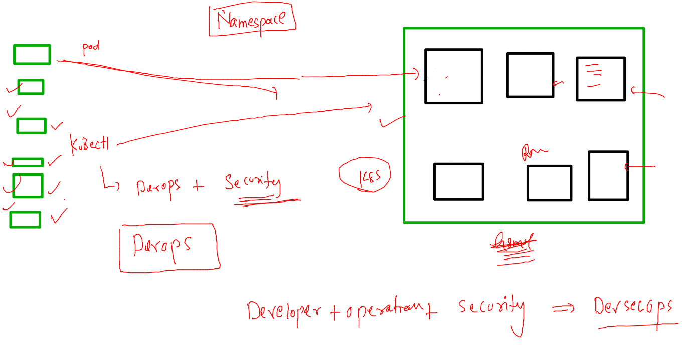

# HCL_devsecops

## training plan 


## create POD YAML and deploy in kubernetes 

### generate Pod YAML -- automatically 

```
kubectl run  ashupod2 --image=dockerashu/ashuhcl:appv1 --port 80 --dry-run=client -o yaml  
apiVersion: v1
kind: Pod
metadata:
  creationTimestamp: null
  labels:
    run: ashupod2
  name: ashupod2
spec:

===

 kubectl run  ashupod2 --image=dockerashu/ashuhcl:appv1 --port 80 --dry-run=client -o yaml   >ashupod2.yaml 

```

### deploy yaml 

```
kubectl  create  -f  ashupod2.yaml 
pod/ashupod2 created
[ashu@ip-172-31-46-30 k8s-deploy]$ kubectl  get  pods
NAME       READY   STATUS    RESTARTS   AGE
ashupod2   1/1     Running   0          20s
hemapod2   1/1     Running   0          8s
saipod2    1/1     Running   0          5m27s
```
### getting started with k8s networking 

### pod ip can't be reached by public users 


### k8s internal LB will present in every worker node 


### creating service 


```
kubectl  expose  pod  ashupod2  --type NodePort --port 80 --name ashuinternal-lb 
service/ashuinternal-lb exposed
[ashu@ip-172-31-46-30 k8s-deploy]$ kubectl  get  service 
NAME              TYPE        CLUSTER-IP       EXTERNAL-IP   PORT(S)        AGE
ashuinternal-lb   NodePort    10.105.137.162   <none>        80:31464/TCP   7s
kubernetes        ClusterIP   10.96.0.1        <none>        443/TCP        19h
```

### to access application public users can use any worker IP 


### Deployment resource in kubernetes 


### creating deployment --

```
kubectl  create  deployment  ashu-app --image=dockerashu/ashuhcl:appv1 --port 80 --dry-run=client -o yaml  >deployment1.yaml 
```

### deploy it 

```
 kubectl  create -f  deployment1.yaml 
deployment.apps/ashu-app created
[ashu@ip-172-31-46-30 k8s-deploy]$ kubectl   get  deployment  
NAME       READY   UP-TO-DATE   AVAILABLE   AGE
ashu-app   1/1     1            1           6s
[ashu@ip-172-31-46-30 k8s-deploy]$ kubectl   get  po
NAME                        READY   STATUS    RESTARTS   AGE
ashu-app-698f6f66b8-ggt5k   1/1     Running   0          15s
[ashu@ip-172-31-46-30 k8s-deploy]$ 

```

### recreation check 

```
 kubectl  delete pod ashu-app-698f6f66b8-ggt5k
pod "ashu-app-698f6f66b8-ggt5k" deleted
[ashu@ip-172-31-46-30 k8s-deploy]$ kubectl  get pods
NAME                           READY   STATUS    RESTARTS   AGE
anji-app-84494dd457-9zflq      1/1     Running   0          3m55s
ashu-app-698f6f66b8-64tnb      1/1     Running   0          3s
```

### now creating nodeport service using deployment expose 

```
 kubectl  expose deployment  ashu-app  --type NodePort --port 80 --name ashulb1 --dry-run=client  -o yaml >ashulb1.yaml 
[ashu@ip-172-31-46-30 k8s-deploy]$ kubectl  get  svc
NAME         TYPE        CLUSTER-IP   EXTERNAL-IP   PORT(S)   AGE
kubernetes   ClusterIP   10.96.0.1    <none>        443/TCP   17m
[ashu@ip-172-31-46-30 k8s-deploy]$ ls
ashulb1.yaml  ashupod1.yaml  ashupod2.yaml  deployment1.yaml
[ashu@ip-172-31-46-30 k8s-deploy]$ kubectl  create -f ashulb1.yaml 
service/ashulb1 created
[ashu@ip-172-31-46-30 k8s-deploy]$ kubectl  get  svc 
NAME         TYPE        CLUSTER-IP      EXTERNAL-IP   PORT(S)        AGE
ashulb1      NodePort    10.97.248.250   <none>        80:30689/TCP   3s
kubernetes   ClusterIP   10.96.0.1       <none>        443/TCP        17m

```
### scaling in pod 


## horizental 
```
 kubectl   scale deploy  ashu-app  --replicas=3
deployment.apps/ashu-app scaled
```

### k8s service will be using label of pod to find 


### deploy multiple files using kubectl 

```
kubectl  create  -f deployment1.yaml -f ashulb1.yaml 
deployment.apps/ashu-app created
service/ashulb1 created
[ashu@ip-172-31-46-30 k8s-deploy]$ 
[ashu@ip-172-31-46-30 k8s-deploy]$ kubectl  get deploy 
NAME       READY   UP-TO-DATE   AVAILABLE   AGE
ashu-app   1/1     1            1           5s
[ashu@ip-172-31-46-30 k8s-deploy]$ kubectl  get svc
NAME         TYPE        CLUSTER-IP      EXTERNAL-IP   PORT(S)        AGE
ashulb1      NodePort    10.99.228.139   <none>        80:31648/TCP   7s
```

### namespace in k8s 



### all resources are landing in default namespace 

```
kubectl   get namespaces 
NAME              STATUS   AGE
default           Active   21h
kube-node-lease   Active   21h
kube-public       Active   21h
kube-system       Active   21h
[ashu@ip-172-31-46-30 k8s-deploy]$ kubectl   get  po 
No resources found in default namespace.
[ashu@ip-172-31-46-30 k8s-deploy]$ kubectl   get  deploy 
No resources found in default namespace.
```

### creating namespaces

```
[ashu@ip-172-31-46-30 k8s-deploy]$ kubectl  create  namespace  ashu-project 
namespace/ashu-project created
[ashu@ip-172-31-46-30 k8s-deploy]$ kubectl   get  ns
NAME              STATUS   AGE
ashu-project      Active   4s
default           Active   21h
kube-node-lease   Active   21h
kube-public       Active   21h
kube-system       Active   21h
```

### setting default namespace 

```
kubectl  get  pods
No resources found in default namespace.
[ashu@ip-172-31-46-30 k8s-deploy]$ 
[ashu@ip-172-31-46-30 k8s-deploy]$ kubectl  config set-context --current --namespace=ashu-project 
Context "kubernetes-admin@kubernetes" modified.
[ashu@ip-172-31-46-30 k8s-deploy]$ 
[ashu@ip-172-31-46-30 k8s-deploy]$ kubectl  get  pods
No resources found in ashu-project namespace.
```

### checking default namespace 

```
kubectl  config get-contexts 
CURRENT   NAME                          CLUSTER      AUTHINFO           NAMESPACE
*         kubernetes-admin@kubernetes   kubernetes   kubernetes-admin   ashu-project
[ashu@ip-172-31-46-30 k8s-deploy]$ 
[ashu@ip-172-31-46-30 k8s-deploy]$ 

```

### deploy in personal namespace 

```
 
[ashu@ip-172-31-46-30 k8s-deploy]$ kubectl  create -f  deployment1.yaml  -f  ashulb1.yaml 
deployment.apps/ashu-app created
service/ashulb1 created
[ashu@ip-172-31-46-30 k8s-deploy]$ kubectl  get deploy 
NAME       READY   UP-TO-DATE   AVAILABLE   AGE
ashu-app   1/1     1            1           4s
[ashu@ip-172-31-46-30 k8s-deploy]$ kubectl  get svc
NAME      TYPE       CLUSTER-IP       EXTERNAL-IP   PORT(S)        AGE
ashulb1   NodePort   10.103.144.116   <none>        80:32092/TCP   8s
[ashu@ip-172-31-46-30 k8s-deploy]$ 
```

### some security concerns 

### pushing image to ACR 

```
 docker  tag  ashusecret:appv1  hclindia.azurecr.io/ashusecret:appv1
[ashu@ip-172-31-46-30 docker-task1]$ docker login  hclindia.azurecr.io 
Username: hclindia
Password: 
WARNING! Your password will be stored unencrypted in /home/ashu/.docker/config.json.
Configure a credential helper to remove this warning. See
https://docs.docker.com/engine/reference/commandline/login/#credentials-store

Login Succeeded
[ashu@ip-172-31-46-30 docker-task1]$ docker  push  hclindia.azurecr.io/ashusecret:appv1
The push refers to repository [hclindia.azurecr.io/ashusecret]
3127370e3c1e: Pushed 
33e3df466e11: Pushed 
747b7a567071: Pushed 
57d3fc88cb3f: Pushed 
53ae81198b64: Pushed 
58354abe5f0e: Pushed 
ad6562704f37: Pushed 
appv1: digest: sha256:b11c6f7e20b7036bc503b6c1862440ab281c1979714666c7d66fad4835a55f35 size: 1781
[ashu@ip-172-31-46-30 docker-task1]$ docker logout   hclindia.azurecr.io 
Removing login credentials for hclindia.azurecr.io
```

### creating deployment using ACR image 

```
kubectl  create deploy  ashu-secure-app --image=hclindia.azurecr.io/ashusecret:appv1   --port 80  --dry-run=client -o yaml >secureapp.yaml
```

##

```

kubectl  create -f  secureapp.yaml 
deployment.apps/ashu-secure-app created
[ashu@ip-172-31-46-30 k8s-deploy]$ kubectl  get deploy 
NAME              READY   UP-TO-DATE   AVAILABLE   AGE
ashu-secure-app   0/1     1            0           10s
[ashu@ip-172-31-46-30 k8s-deploy]$ kubectl  get  po
NAME                               READY   STATUS             RESTARTS   AGE
ashu-secure-app-76b77fffdf-9vkpm   0/1     ImagePullBackOff   0          31s
[ashu@ip-172-31-46-30 k8s-deploy]$ 

```

### any private registry image can't be deployed by k8s so need to store that infromation in registry secret 


### creating 

```
kubectl  create  secret  docker-registry  ashu-secret  --docker-server=hclindia.azurecr.io  --docker-username=hclindia  --docker-password="u/7xTlSgDT1NA2p"

kubectl  get secrets
NAME          TYPE                             DATA   AGE
ashu-secret   kubernetes.io/dockerconfigjson   1      82s

```

### replace with new changes 

```
 kubectl  replace  -f secureapp.yaml  --force
deployment.apps "ashu-secure-app" deleted
deployment.apps/ashu-secure-app replaced
[ashu@ip-172-31-46-30 k8s-deploy]$ kubectl   get  deploy 
NAME              READY   UP-TO-DATE   AVAILABLE   AGE
ashu-secure-app   0/1     1            0           20s
[ashu@ip-172-31-46-30 k8s-deploy]$ kubectl   get  po
NAME                               READY   STATUS    RESTARTS   AGE
ashu-secure-app-575f6f76f5-68kq9   1/1     Running   0          25s
[ashu@ip-172-31-46-30 k8s-deploy]$ kubectl   get  deploy 
NAME              READY   UP-TO-DATE   AVAILABLE   AGE
ashu-secure-app   1/1     1            1           29s
[ashu@ip-172-31-46-30 k8s-deploy]$ 
```

### --

```
kubectl  create  -f  ashupod1.yaml  -n  tasks 
pod/ashu-pod-1 created
[ashu@ip-172-31-46-30 k8s-deploy]$ kubectl get  pods   -n  tasks 
NAME         READY   STATUS    RESTARTS   AGE
ashu-pod-1   1/1     Running   0          10s
[ashu@ip-172-31-46-30 k8s-deploy]$ kubectl get  svc   -n  tasks 
No resources found in tasks namespace.
[ashu@ip-172-31-46-30 k8s-deploy]$ kubectl delete -f ashupod1.yaml   -n  tasks 
pod "ashu-pod-1" deleted
[ashu@ip-172-31-46-30 k8s-deploy]$ 
```
### Importance External LB in k8s 


### cloud service for External LB 


### deploy app in azure kubernetes service 

```
 
fire@ashutoshhs-MacBook-Air Downloads % kubectl  get  deploy 
NAME       READY   UP-TO-DATE   AVAILABLE   AGE
ashu-app   1/1     1            1           44s
fire@ashutoshhs-MacBook-Air Downloads % 
fire@ashutoshhs-MacBook-Air Downloads % 
fire@ashutoshhs-MacBook-Air Downloads % kubectl expose deploy  ashu-app --type LoadBalancer --port 80 --name lb1 
service/lb1 exposed
fire@ashutoshhs-MacBook-Air Downloads % kubectl  get  svc 
NAME         TYPE           CLUSTER-IP    EXTERNAL-IP   PORT(S)        AGE
kubernetes   ClusterIP      10.0.0.1      <none>        443/TCP        11m
lb1          LoadBalancer   10.0.150.87   <pending>     80:31508/TCP   4s
fire@ashutoshhs-MacBook-Air Downloads % p
zsh: command not found: p
fire@ashutoshhs-MacBook-Air Downloads % kubectl  get  svc 
NAME         TYPE           CLUSTER-IP    EXTERNAL-IP     PORT(S)        AGE
kubernetes   ClusterIP      10.0.0.1      <none>          443/TCP        12m
lb1          LoadBalancer   10.0.150.87   20.204.211.17   80:31508/TCP   56s
fire@ashutoshhs-MacBook-Air Downloads % 

```


