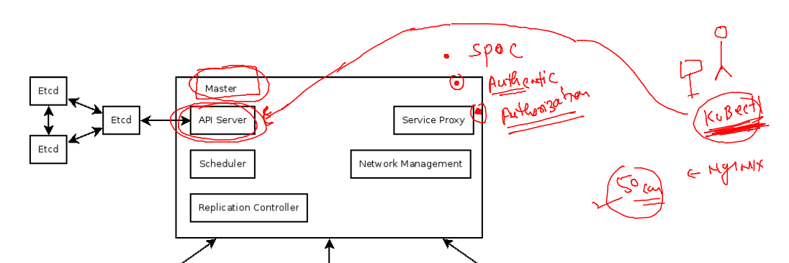

# HCL_devsecops

## training plan 


### revision of deploying a website in aws vm 

```
 1  yum install  git httpd -y 
    2  git clone https://github.com/yenchiah/project-website-template.git
    3  ls
    4  cp -rf project-website-template/*  /var/www/html/
    5  systemctl start httpd
    6  systemctl status  httpd
```

### changing resource of vm 

### we need to stop the vm 

### creating and confiugration is the new problem which leads to time 


### solving above problem by implementing logics in ops 


### devops tools for provisioning and configuration management


### intro to terraform and ansible 


### getting started with cloud resources provisioning tool  terraform -- non cloud resources 


### Install terraform on amazon linux 

[use_link](https://learn.hashicorp.com/tutorials/terraform/install-cli)

```
 11  sudo yum install -y yum-utils
   12  sudo yum-config-manager --add-repo https://rpm.releases.hashicorp.com/AmazonLinux/hashicorp.repo
   13  sudo yum -y install terraform
```

### how terraform will connect target AWS infra 



### configure your terraform machine to access aws credentials 

```
aws  configure  
AWS Access Key ID [None]: 4VEXN
AWS Secret Access Key [None]: +sG/U0x30
Default region name [None]: us-east-2
Default output format [None]: 
```

### using HCL -- to write terraform scripts 


### sample code to provision tf 

```
# provider means always -- what is your target cloud 
provider "aws" {
    region = "us-east-2" # name of Ohio region  
   # access_key =  "" we have already configured it using aws configure 
   # secret_key =  ""
}

#         name of resource  name of vm 
resource "aws_instance" "ashuvm1" {
    ami = "ami-0fa49cc9dc8d62c84"
    instance_type = "t2.micro"
    tags = {
        "Name" = "ashu-vm1-by-tf"
    }
    key_name = "ashuday2"
    
} 

```

## run script 

### terraform Init -- only time --

```
[ashu@ip-172-31-46-30 automation]$ terraform  init 

Initializing the backend...

Initializing provider plugins...
- Finding latest version of hashicorp/aws...
- Installing hashicorp/aws v4.17.1...
- Installed hashicorp/aws v4.17.1 (signed by HashiCorp)

```

### lets check what is going to happen -- kind of dry-run 

```
terraform  plan 

Terraform used the selected providers to generate the following execution plan. Resource actions are indicated with the
following symbols:
  + create

Terraform will perform the following actions:

  # aws_instance.ashuvm1 will be created
  + resource "aws_instance" "ashuvm1" {
      + ami                                  = "ami
```

### lets deploy it 

```
terraform  apply 

Terraform used the selected providers to generate the following execution plan. Resource actions are indicated with the
following symbols:
  + create

Terraform will perform the following actions:

  # aws_instance.ashuvm1 will be created
  
  
Do you want to perform these actions?
  Terraform will perform the actions described above.
  Only 'yes' will be accepted to approve.

  Enter a value: yes

aws_instance.ashuvm1: Creating...
aws_instance.ashuvm1: Still creating... [10s elapsed]
aws_instance.ashuvm1: Still creating... [20s elapsed]
aws_instance.ashuvm1: Still creating... [30s elapsed]
aws_instance.ashuvm1: Creation complete after 32s [id=i-0a9ad48e22cd90d1d]

Apply complete! Resources: 1 added, 0 changed, 0 destroyed.
```

### terraform in one line 


