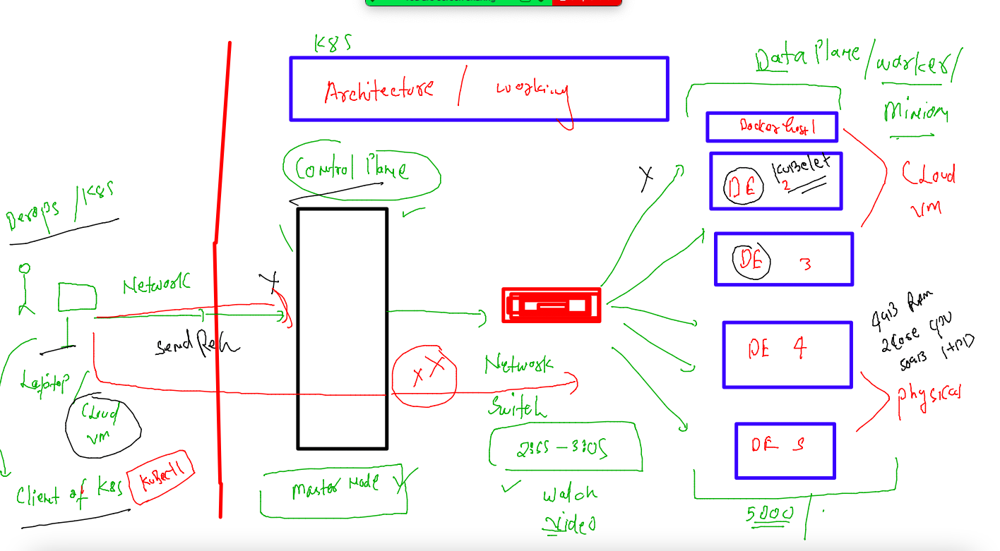

# HCL_devsecops

## training plan 


### Docker compose and github concept 


### some compose examples 

### example 1 

```
version: '3.8'
services:
  ashuapp1: # name of app for compose 
    image: alpine
    container_name: ashuc001 
    command: ping fb.com 

# docker run --name ashu001 alpine ping fb.com  
  

```

### running it 

```
[ashu@ip-172-31-46-30 automation]$ cd  ashu-compose-test/
[ashu@ip-172-31-46-30 ashu-compose-test]$ ls
docker-compose.yaml
[ashu@ip-172-31-46-30 ashu-compose-test]$ docker-compose up -d 
[+] Running 2/2
 ⠿ Network ashu-compose-test_default  Created                                            0.1s
 ⠿ Container ashuc001                 Started                                            1.0s
[ashu@ip-172-31-46-30 ashu-compose-test]$ 
```

### few more commands 

```
docker-compose ps
NAME                COMMAND             SERVICE             STATUS              PORTS
ashuc001            "ping fb.com"       ashuapp1            running             
[ashu@ip-172-31-46-30 ashu-compose-test]$ docker-compose kill
[+] Running 1/1
 ⠿ Container ashuc001  Killed                                                            0.2s
[ashu@ip-172-31-46-30 ashu-compose-test]$ docker-compose ps
NAME                COMMAND             SERVICE             STATUS              PORTS
ashuc001            "ping fb.com"       ashuapp1            exited (137)        
[ashu@ip-172-31-46-30 ashu-compose-test]$ docker-compose start
[+] Running 1/1
 ⠿ Container ashuc001  Started                               

```

### clean up 

```
[ashu@ip-172-31-46-30 ashu-compose-test]$ docker-compose  down 
[+] Running 2/2
 ⠿ Container ashuc001                 Removed                                           10.2s
 ⠿ Network ashu-compose-test_default  Removed                                            0.1s
[ashu@ip-172-31-46-30 ashu-compose-test]$ 
```

### example 2 

```
version: '3.8'
services:
  ashuapp2: 
    image: ashuhcl:appv2 # name of image want to build
    build: . # location of dockerfile
    container_name: ashuc002
    ports:
    - 1234:80 
  ashuapp1: # name of app for compose 
    image: alpine
    container_name: ashuc001 
    command: ping fb.com 

# docker run --name ashu001 alpine ping fb.com  
  

```

### running it 

```
 docker-compose  up -d --build 
[+] Building 0.4s (7/7) FINISHED                                                              
 => [internal] load build definition from Dockerfile                                     0.0s
 => => transferring dockerfile: 272B                                                     0.0s
 => [internal] load .dockerignore                                                        0.0s
 => => transferring context: 2B                                                          0.0s
 => [internal] load metadata for docker.io/library/nginx:latest                          0.0s
 => [internal] load build context                                                        0.1s
 => => transferring context: 1.33MB                                                      0.0s
 => CACHED [1/2] FROM docker.io/library/nginx                                            0.0s
 => [2/2] ADD project-html-website /usr/share/nginx/html/                                0.1s
 => exporting to image                                                                   0.0s
 => => exporting layers                                                                  0.0s
 => => writing image sha256:d980f79380b6c5fd503128c6be6fd58cf04182a8e38ecc5cbc0d475cbe7  0.0s
 => => naming to docker.io/library/ashuhcl:appv2                                         0.0s
[+] Running 3/3
 ⠿ Network ashu-compose-test_default  Created                                            0.1s
 ⠿ Container ashuc001                 Started                                            1.1s
 ⠿ Container ashuc002                 Started        

```

### container are good and also light weight fast , easy to build 

### we have a new problem 


### introduction to container orchestration engine 


### k8s use case with netflix 


## Info about kubernetes k8s 


## k8s infra setup 

## minion / worker node setup 

### step 

```
 ssh -i  ashuday2.pem  ec2-user@3.145.129.211    
The authenticity of host '3.145.129.211 (3.145.129.211)' can't be established.
ECDSA key fingerprint is SHA256:6YgQgdI8NKosbE5eb0JvBKU3OX7LddRsFPg8yrLvcLc.
Are you sure you want to continue connecting (yes/no/[fingerprint])? yes
Warning: Permanently added '3.145.129.211' (ECDSA) to the list of known hosts.

       __|  __|_  )
       _|  (     /   Amazon Linux 2 AMI
      ___|\___|___|

https://aws.amazon.com/amazon-linux-2/
16 package(s) needed for security, out of 26 available
Run "sudo yum update" to apply all updates.
-bash: warning: setlocale: LC_CTYPE: cannot change locale (UTF-8): No such file or directory
[ec2-user@ip-172-31-18-243 ~]$ 
[ec2-user@ip-172-31-18-243 ~]$ 
[ec2-user@ip-172-31-18-243 ~]$ sudo -i
[root@ip-172-31-18-243 ~]# hostnamectl set-hostname  ashu-worker
[root@ip-172-31-18-243 ~]# exit
logout
[ec2-user@ip-172-31-18-243 ~]$ sudo -i
[root@ashu-worker ~]# 


```

### step 2 : install and start docker 

```
 yum  install  docker  -y ; systemctl enable --now docker
 
```
##

```
cat  <<X  >/etc/docker/daemon.json
{
  "exec-opts": ["native.cgroupdriver=systemd"]
}

X

```

###
```
systemctl daemon-reload
systemctl restart docker

```
### step 3
### enable kernel bridge module 

```
[root@ashu-worker ~]# modprobe br_netfilter
[root@ashu-worker ~]# echo '1' > /proc/sys/net/bridge/bridge-nf-call-iptables

```

### step 4 install kubelet 

```
cat  <<EOF  >/etc/yum.repos.d/kube.repo
[kube]
baseurl=https://packages.cloud.google.com/yum/repos/kubernetes-el7-x86_64
gpgcheck=0
EOF

```
### 

```
yum  install kubelet  kubeadm -y

```

###

```
 systemctl enable --now kubelet 
```

### How to configure k8s client --

```

[root@ip-172-31-46-30 ~]# curl -LO "https://dl.k8s.io/release/$(curl -L -s https://dl.k8s.io/release/stable.txt)/bin/linux/amd64/kubectl"
  % Total    % Received % Xferd  Average Speed   Time    Time     Time  Current
                                 Dload  Upload   Total   Spent    Left  Speed
100   154  100   154    0     0   1842      0 --:--:-- --:--:-- --:--:--  1855
100 43.5M  100 43.5M    0     0  48.8M      0 --:--:-- --:--:-- --:--:-- 79.3M
[root@ip-172-31-46-30 ~]# ls
kubectl  project-website-template
[root@ip-172-31-46-30 ~]# mv  kubectl  /usr/bin/
[root@ip-172-31-46-30 ~]# 
[root@ip-172-31-46-30 ~]# chmod +x  /usr/bin/kubectl 
[root@ip-172-31-46-30 ~]# 
[root@ip-172-31-46-30 ~]# 

```

### verify -- 

```
[ashu@ip-172-31-46-30 automation]$ kubectl  version --client -oyaml 
clientVersion:
  buildDate: "2022-05-24T12:26:19Z"
  compiler: gc
  gitCommit: 3ddd0f45aa91e2f30c70734b175631bec5b5825a
  gitTreeState: clean
  gitVersion: v1.24.1
  goVersion: go1.18.2
  major: "1"
  minor: "24"
  platform: linux/amd64
kustomizeVersion: v4.5.4

```

### how k8s client can connect to control plane 




### k8s master node components 

### kube-apiserver 


### brain of k8s -- ETCD 


### lets connect to master node

```
kubectl   get  nodes  --kubeconfig  admin.conf  
NAME            STATUS   ROLES           AGE   VERSION
anji-work       Ready    <none>          35m   v1.24.1
control-plane   Ready    control-plane   42m   v1.24.1
deepak-worker   Ready    <none>          36m   v1.24.1
divya-worker    Ready    <none>          38m   v1.24.1
gopal-worker    Ready    <none>          38m   v1.24.1
hema-worker     Ready    <none>          40m   v1.24.1
sai-worker      Ready    <none>          39m   v1.24.1
vamshi-worker   Ready    <none>          39m   v1.24.

```

###

```
 kubectl   cluster-info  --kubeconfig  admin.conf  
Kubernetes control plane is running at https://172.31.18.243:6443
CoreDNS is running at https://172.31.18.243:6443/api/v1/namespaces/kube-system/services/kube-dns:dns/proxy

To further debug and diagnose cluster problems, use 'kubectl cluster-info dump'.
[ashu@ip-172-31-46-30 automation]$ 

```

### setup admin.conf 

```
 mkdir  ~/.kube
mkdir: cannot create directory ‘/home/ashu/.kube’: File exists
[ashu@ip-172-31-46-30 automation]$ 
[ashu@ip-172-31-46-30 automation]$ cp  -v  admin.conf   ~/.kube/config 
‘admin.conf’ -> ‘/home/ashu/.kube/config’
[ashu@ip-172-31-46-30 automation]$ 
[ashu@ip-172-31-46-30 automation]$ 
[ashu@ip-172-31-46-30 automation]$ kubectl  get  nodes
NAME            STATUS   ROLES           AGE   VERSION
anji-work       Ready    <none>          39m   v1.24.1
control-plane   Ready    control-plane   45m   v1.24.1
deepak-worker   Ready    <none>          39m   v1.24.1
divya-worker    Ready    <none>          42m   v1.2
```
