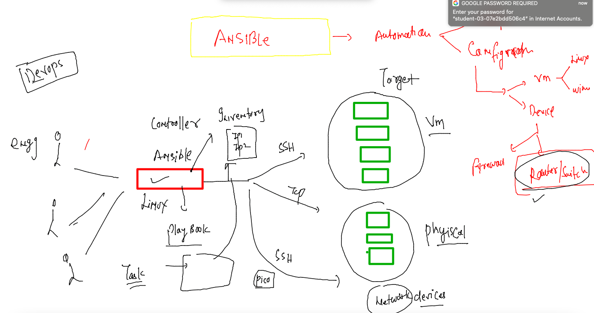

# HCL_devsecops

## training plan 


###  revision 


### Ansible setup and its connection 



### running ansible adhoc command 


### testing connection from ansible to target 

```
[ashu@ip-172-31-46-30 ansible-code]$ ansible  -i inventory myservers  -u ec2-user -m ping  -k 
SSH password: 
[WARNING]: Platform linux on host 172.31.46.194 is using the discovered Python interpreter at /usr/bin/python, but future
installation of another Python interpreter could change this. See
https://docs.ansible.com/ansible/2.9/reference_appendices/interpreter_discovery.html for more information.
172.31.46.194 | SUCCESS => {
    "ansible_facts": {
        "discovered_interpreter_python": "/usr/bin/python"
    }, 
    "changed": false, 
    "ping": "pong"

```

### writing playbooks 

## Inventory file 

```
[myservers]
172.31.37.223
172.31.32.236
172.31.36.63
172.31.46.194
172.31.32.32
172.31.36.116
172.31.46.230
172.31.37.89
172.31.36.64
172.31.45.68
```

### first playbook 

```
---
- hosts: myservers
  remote_user: ec2-user 
  tasks: 
  - name: testing all the target servers
    command: date 
```

### running playbook 

```
 cd  ansible-code/
[ashu@ip-172-31-46-30 ansible-code]$ ls
apache.yaml  inventory
[ashu@ip-172-31-46-30 ansible-code]$ ansible-playbook -i inventory apache.yaml --ask-pass

SSH password: 

PLAY [myservers] ****************************************************************************************************

TASK [Gathering Facts] **********************************************

TASK [testing all the target servers] *******************************************************************************
changed: [172.31.32.32]
changed: [172.31.32.236]
changed: [172.31.37.223]
changed: [172.31.46.194]
changed: [172.31.36.63]
changed: [172.31.36.116]
changed: [172.31.46.230]
changed: [172.31.37.89]
changed: [172.31.36.64]
changed: [172.31.45.68]

PLAY RECAP **********************************************************************************************************
172.31.32.236              : ok=2    changed=1    unreachable=0    failed=0    skipped=0    rescued=0    ignored=0   
172.31.32.32               : ok=2    changed=1    unreachable=0    failed=0    skipped=0    rescued=0    ignored=0   
172.31.36.116              : ok=2    changed=1    unreachable=0    failed=0    skipped=0    rescued=0    ignored=0   
172.31.36.63               : ok=2    changed=1    unreachable=0    failed=0    skipped=0    rescued=0    ignored=0   
172.31.36.64               : ok=2    changed=1    unreachable=0    failed=0    skipped=0    rescued=0    ignored=0   
172.31.37.223              : ok=2    changed=1    unreachable=0    failed=0    skipped=0    rescued=0    ignored=0   
172.31.37.89               : ok=2    changed=1    unreachable=0    failed=0    skipped=0    rescued=0    ignored=0   
172.31.45.68               : ok=2    changed=1    unreachable=0    failed=0    skipped=0    rescued=0    ignored=0   
172.31.46.194              : ok=2    changed=1    unreachable=0    failed=0    skipped=0    rescued=0    ignored=0   
172.31.46.230              : ok=2    changed=1    unreachable=0    failed=0    skipped=0    rescued=0    ignored=0   

```


